---
---

# From Pixels to Predictions: How CNNs Crushed ANNs in the Battle for Street-Level Recognition

*How choosing the right neural network architecture took digit recognition accuracy from 65% to 91% -- and what business leaders should know about it.*

---

## The Business Problem: Reading House Numbers at Scale

Imagine you are Google, and you need to read billions of house numbers from Street View photos to improve map accuracy. Hiring humans to manually transcribe every address number from every street-level photo in the world is not feasible. You need a machine that can look at a tiny, grainy, sometimes blurry photo of a digit and correctly identify what number it is.

This is the problem behind the Street View House Numbers (SVHN) dataset -- one of the most widely used benchmarks in the field of Deep Learning (DL), which is a branch of Artificial Intelligence (AI) that teaches computers to learn patterns from data using layered mathematical models called neural networks. The SVHN dataset contains over 600,000 labeled digit images cropped from real Google Street View photos. Getting this right means better maps, better navigation, and better location services for billions of users.

The question we set out to answer: **Which type of neural network architecture delivers the best accuracy for this real-world image recognition task?**

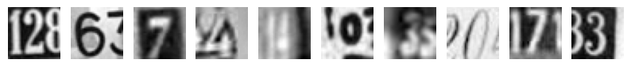
*Actual digit images from the dataset. Each is a tiny 32x32 pixel grayscale crop from a street-level photo. Notice the noise, blur, and varying lighting -- this is not a clean laboratory dataset.*

---

## The Experiment: A Head-to-Head Comparison

We built and tested four different neural network models on the same dataset of 60,000 digit images (42,000 for training and 18,000 for testing). The models fall into two fundamentally different families:

- **Artificial Neural Network (ANN):** A type of neural network where every input is connected to every processing unit. ANNs are general-purpose pattern recognizers that treat each input value independently.
- **Convolutional Neural Network (CNN):** A type of neural network specifically designed for image data. CNNs use small sliding filters to detect visual patterns like edges and shapes, preserving the spatial structure of the image.

The core difference is straightforward: ANNs ignore the fact that the input is an image, while CNNs are built to exploit it.

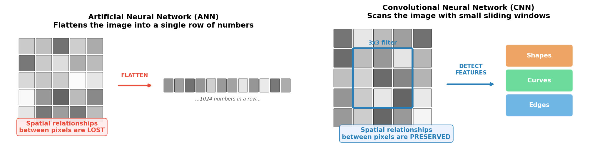
*The fundamental difference. An ANN flattens the image into a long list of numbers, destroying the spatial layout. A CNN keeps the 2D structure intact and scans for visual features like edges and curves -- the way a human eye would.*

---

## How the Data Flows: From Raw Photo to Prediction

Before any model can learn, the raw image data must be transformed into a format the computer can work with. Here is the pipeline every image passes through:

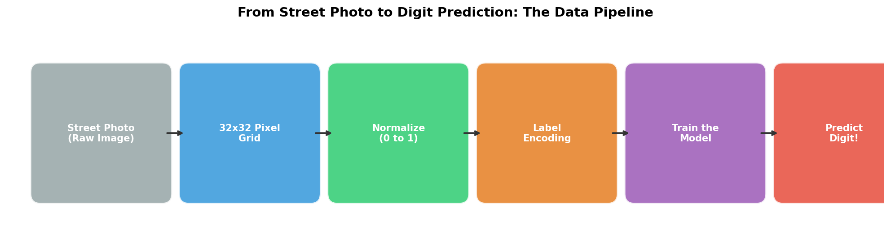

1. **Raw Image:** A cropped digit photo from Google Street View.
2. **32x32 Pixel Grid:** Each image is a 32x32 grid of pixel values ranging from 0 (black) to 255 (white).
3. **Normalization:** Pixel values are scaled to a 0-to-1 range so the model trains more efficiently and stably.
4. **Label Encoding:** Each digit label (0-9) is converted into a ten-element vector using a technique called One-Hot Encoding (OHE), which represents each category as a binary vector. For example, the digit "3" becomes [0, 0, 0, 1, 0, 0, 0, 0, 0, 0].
5. **Model Training:** The processed images are fed into the neural network, which adjusts its internal weights to learn digit patterns.
6. **Prediction:** Given a new, unseen image, the model outputs which digit it believes is shown.

---

## The Four Contenders

### ANN Model 1: The Simple Baseline

The first model was intentionally simple -- a minimal ANN with just two hidden processing layers (64 and 32 nodes). Think of it as a first draft: fast to build, fast to train, but limited in what it can learn.

**Result: ~65% accuracy**

With 10 possible digits, random guessing would yield 10% accuracy. So 65% is a meaningful lift -- the model clearly learned something -- but it is far from production quality. It reached its performance ceiling quickly and plateaued after just 5-7 rounds of training (called Epochs, which are complete passes through the entire training dataset).

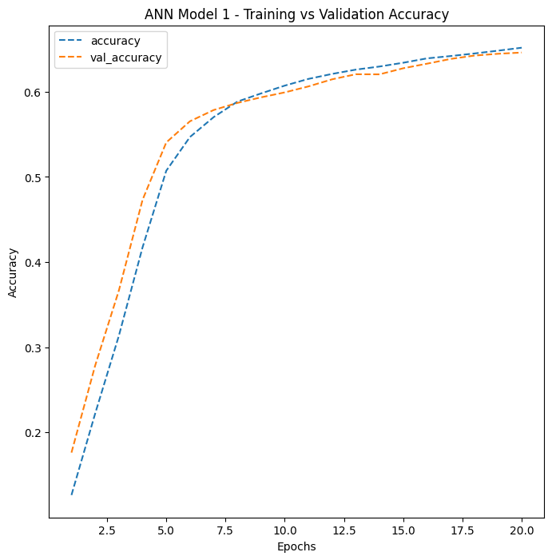
*ANN Model 1's training curve. Both training and validation accuracy plateau quickly, indicating the model has reached its capacity limit.*

### ANN Model 2: More Depth, More Regularization

The second model was a deeper ANN with five hidden layers (256, 128, 64, 64, and 32 nodes) and two key enhancements:

- **Dropout:** A regularization technique that randomly deactivates 20% of neurons during each training step. Dropout forces the network to learn more robust patterns rather than memorizing the training data. Think of it like training with a blindfold -- it forces the model to develop multiple strategies for identifying digits, rather than relying too heavily on any single pathway.
- **Batch Normalization (BN):** A technique that normalizes the values flowing through the network at each layer, stabilizing and accelerating the training process. BN acts like a quality control checkpoint that keeps the numbers flowing through the network in a healthy range.

**Result: ~75% accuracy**

A 10-percentage-point improvement over the simple model. The deeper architecture and regularization helped, but the fundamental limitation remained: flattening the 2D image into a 1D list of numbers destroys the spatial relationships between pixels that are critical for recognizing visual patterns.

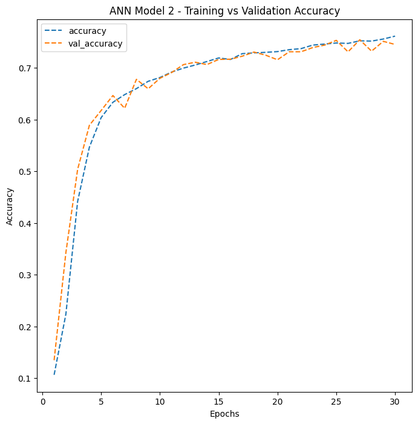
*ANN Model 2 shows steady improvement over 30 epochs with a moderate gap between training and validation accuracy -- a sign of some overfitting, where the model performs better on training data than on new, unseen data.*

### CNN Model 1: Spatial Awareness Changes Everything

The first Convolutional Neural Network (CNN) was a game-changer. Instead of flattening the image, it preserved the 2D spatial structure and scanned it with small 3x3 filters that detect local visual features like edges and corners.

This model used two convolutional layers (16 and 32 filters), a Max Pooling (MP) layer that reduces image dimensions by selecting the most prominent features, and a specialized activation function called Leaky Rectified Linear Unit (LeakyReLU), which allows a small signal to pass even for negative inputs, preventing neurons from becoming permanently inactive.

**Result: ~86% accuracy**

The jump from 75% to 86% -- an 11-percentage-point improvement -- came entirely from changing the architecture to one that understands spatial structure. No additional data, no longer training time. Just a smarter way of looking at the image.

However, this model showed signs of Overfitting -- the model memorized training patterns instead of learning generalizable features. Without regularization, the gap between training accuracy and validation accuracy grew wider as training progressed.

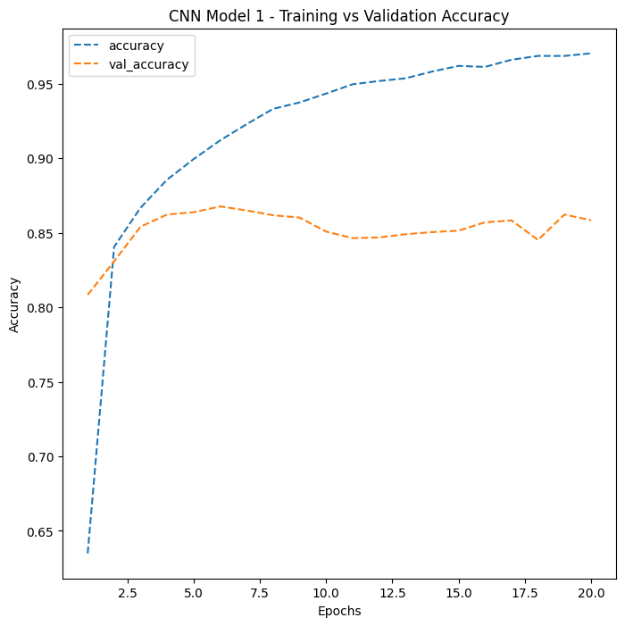
*CNN Model 1 demonstrates the dramatic accuracy jump from switching to convolutional architecture. The widening gap between training and validation curves signals overfitting that needs to be addressed.*

### CNN Model 2: The Champion

The final model combined the spatial intelligence of CNNs with comprehensive regularization. It featured:

- **Four convolutional layers** organized into two blocks (16, 32, 32, and 64 filters), creating a hierarchy: the first block detects simple features (edges, gradients), while the second block combines them into complex patterns (curves, digit shapes).
- **Two Batch Normalization (BN) layers** placed after each pooling stage to stabilize training.
- **Dropout at 50%** on the dense classification layer -- aggressively preventing the model from over-relying on any single neuron.

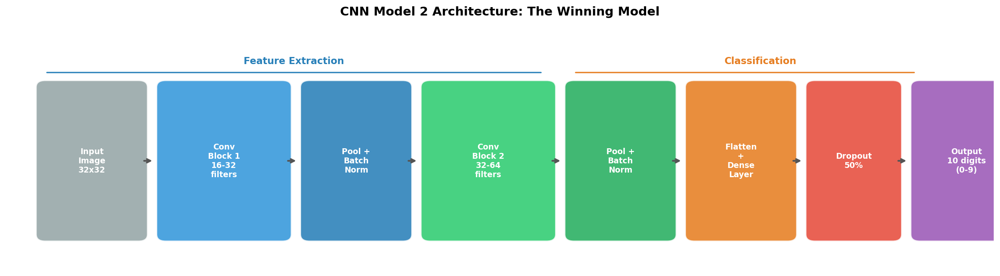
*The winning architecture. Convolutional blocks extract increasingly complex visual features, while pooling, Batch Normalization, and Dropout prevent overfitting.*

**Result: 91% accuracy**

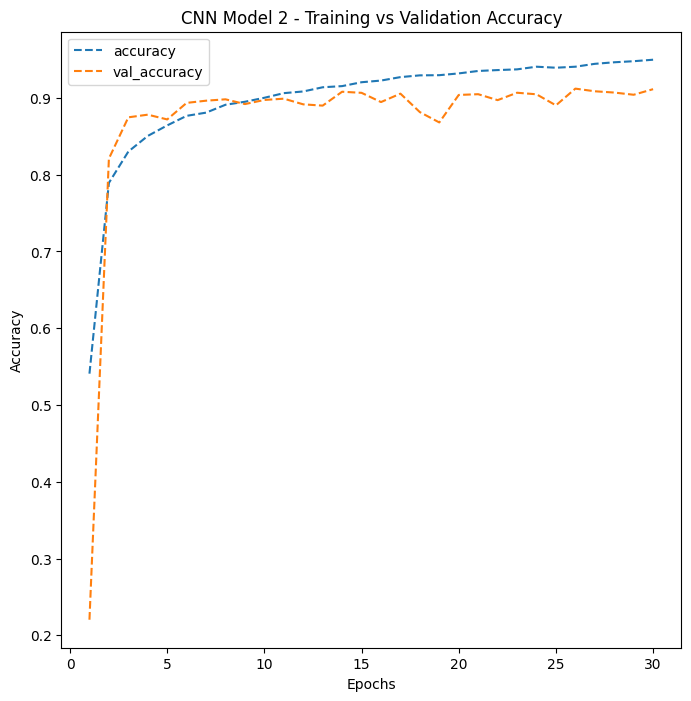
*CNN Model 2 shows the tightest gap between training and validation accuracy among all four models -- strong evidence of good generalization to unseen data.*

---

## The Scoreboard

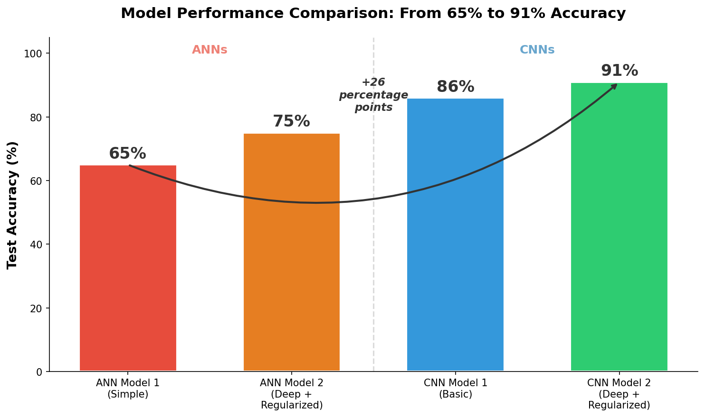
*Four models, one dataset, dramatically different results. The 26-percentage-point improvement from the simplest ANN to the best CNN is entirely driven by architectural choices.*

| Model | Architecture | Test Accuracy | Key Takeaway |
|-------|-------------|:---:|-------------|
| ANN Model 1 | 2 hidden layers, no regularization | 65% | Simple baseline; limited capacity |
| ANN Model 2 | 5 hidden layers + Dropout + Batch Normalization | 75% | Deeper is better, but spatial info is still lost |
| CNN Model 1 | 2 conv layers, no regularization | 86% | Preserving spatial structure yields huge gains |
| **CNN Model 2** | **4 conv layers + Batch Normalization + Dropout** | **91%** | **Best model: depth + spatial awareness + regularization** |

---

## Where Models Succeed and Struggle

Not all digits are created equal. Some are visually distinctive and easy for any model to recognize. Others are ambiguous and trip up even the best architecture.

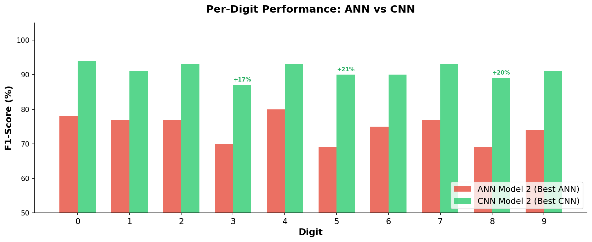
*The CNN improves performance on every single digit, but the biggest gains come on the digits that ANNs struggle with most: 3, 5, and 8.*

**Easy digits (high accuracy for both):** Digits 0 and 7 have distinctive shapes -- a closed oval and an angular stroke -- that even ANNs can recognize fairly well.

**Hard digits (where CNNs shine brightest):**
- **Digit 3** is frequently confused with 8 (both have two curved sections). The CNN improved F1-Score, a single metric that balances both the precision and recall of a model's predictions, from 70% to 87%.
- **Digit 5** shares visual features with 6 (similar upper stroke). The CNN improved its F1-Score from 69% to 90%.
- **Digit 8** is the trickiest -- its visual complexity confuses ANNs badly (69% F1-Score), but CNNs bring it up to 89%.

The CNN's confusion matrix tells the full story:

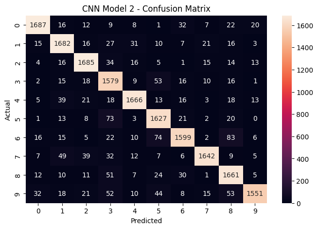
*The confusion matrix for the winning CNN model. The strong diagonal (high numbers on the top-left to bottom-right line) shows correct predictions. Off-diagonal entries reveal which digits still get confused -- mainly visually similar pairs like 3/8 and 5/6.*

For comparison, here is the ANN's confusion matrix -- notice how much more scattered the errors are:

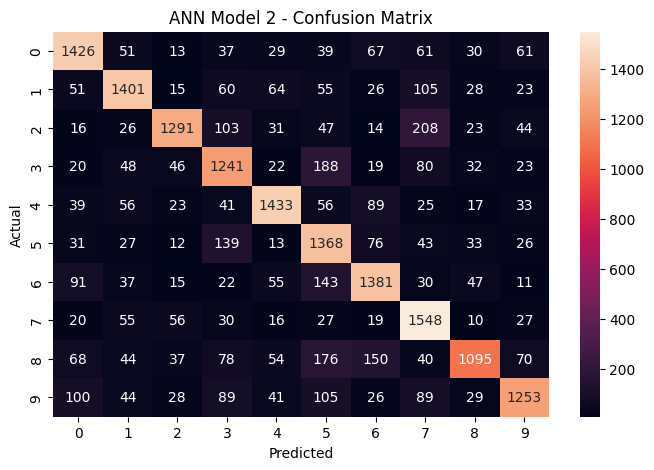
*The ANN confusion matrix shows significantly more misclassifications across all digit pairs, with lower values along the diagonal.*

---

## What This Means for Business

### 1. Architecture Choice Matters More Than Brute Force

The most important finding is not about tuning hyperparameters or training longer. The single biggest accuracy improvement (from 75% to 86%) came from switching from an ANN to a CNN -- a fundamentally different way of processing the data. In business terms: choosing the right tool for the job matters more than optimizing the wrong tool.

### 2. Regularization is Insurance Against Overfitting

Adding Dropout and Batch Normalization (BN) to the CNN improved accuracy from 86% to 91% while also making the model more reliable on unseen data. Regularization is not optional -- it is the difference between a model that performs well in testing and one that performs well in production.

### 3. The 91% Accuracy in Context

For a real-world deployment like Google's address recognition system, 91% accuracy on a challenging dataset like SVHN is strong. For context, the same CNN architecture would achieve approximately 98-99% on the cleaner Modified National Institute of Standards and Technology (MNIST) dataset, which is a benchmark of handwritten digits on uniform white backgrounds. The SVHN images include varying lighting, fonts, backgrounds, and camera angles that make it a much harder problem.

### 4. Diminishing Returns and the Path Forward

The jump from ANN to CNN was dramatic (75% to 91%), but pushing beyond 91% requires techniques like:
- **Data Augmentation (DA):** Artificially expanding the training set by applying random rotations, shifts, and zooms to existing images, teaching the model to recognize digits from more angles and positions.
- **Learning Rate Scheduling (LRS):** Gradually reducing the speed at which the model adjusts its weights as training progresses, allowing finer convergence.
- **Transfer Learning (TL):** Using a pre-trained model that has already learned general visual features from millions of images and fine-tuning it for digit recognition.

Each technique yields smaller gains than the last, so the business question becomes: is the marginal improvement worth the additional computational cost?

---

## The Bottom Line

This study demonstrates a principle that applies far beyond digit recognition: **when your data has inherent structure, use an architecture that respects it.** Images have spatial structure. Time series have temporal structure. Text has sequential structure. Choosing a model architecture that matches the structure of your data is the single highest-leverage decision in any Machine Learning (ML) project -- the application of algorithms that learn patterns from data to make predictions or decisions without being explicitly programmed for each case.

The CNN did not succeed because it was bigger or trained longer. It succeeded because it was designed to see images the way they are meant to be seen: as two-dimensional spatial patterns, not as shuffled lists of numbers.

---

*This analysis was conducted as part of the MIT Professional Education Applied Artificial Intelligence and Deep Signal Processing (AAIDSP) program, using TensorFlow (TF) -- an open-source machine learning framework developed by Google -- running on Google Colab with A100 Graphics Processing Unit (GPU) acceleration, which is specialized hardware designed to perform the massive parallel computations that neural network training requires.*
