# Understanding Temperature in Large Language Models: A Deep Technical Guide

*A comprehensive exploration of temperature parameter mechanics, mathematical foundations, and practical implementation strategies for ML engineers and developers.*

---

## Table of Contents
1. [Introduction](#introduction)
2. [The Problem: Why Do We Need Temperature?](#the-problem-why-do-we-need-temperature)
3. [Mathematical Foundations](#mathematical-foundations)
4. [How Temperature Affects Token Selection](#how-temperature-affects-token-selection)
5. [Visualizing Temperature Effects](#visualizing-temperature-effects)
6. [Practical Code Examples](#practical-code-examples)
7. [Related Generation Parameters](#related-generation-parameters)
8. [Best Practices and Guidelines](#best-practices-and-guidelines)
9. [Common Pitfalls and Edge Cases](#common-pitfalls-and-edge-cases)
10. [Conclusion](#conclusion)

---

## Introduction

When working with Large Language Models (LLMs), you've likely encountered the `temperature` parameter. It's one of the most important hyperparameters for controlling the behavior of text generation, yet it's often misunderstood. This article provides a deep technical dive into how temperature works, its mathematical foundations, and practical guidance for using it effectively in production systems.

**Key Takeaways:**
- Temperature controls the randomness/creativity of LLM outputs
- It modifies the softmax probability distribution over vocabulary tokens
- Low temperature (→0) makes outputs deterministic and focused
- High temperature (→2+) makes outputs creative but potentially incoherent
- The optimal temperature depends on your specific use case

---

## The Problem: Why Do We Need Temperature?

### From Classification to Generation

Traditional classification models and LLMs both use softmax functions, but they differ fundamentally in how they use the output:


**Traditional classifiers are deterministic**: They always select the class with the highest softmax probability. Given the same input, you always get the same output.


**LLMs use sampling**: Instead of always picking the highest probability token, LLMs *sample* from the probability distribution. This introduces randomness that makes outputs more natural and varied—but it also means we need a way to control *how much* randomness we want.

This is where **temperature** comes in.

---

## Mathematical Foundations

### The Standard Softmax Function

The softmax function converts a vector of raw logits (unnormalized scores) into a probability distribution:

$$\text{softmax}(x_i) = \frac{e^{x_i}}{\sum_{j=1}^{N} e^{x_j}}$$

Where:
- $x_i$ is the logit for token $i$
- $N$ is the vocabulary size
- The output is a probability distribution that sums to 1

### Temperature-Adjusted Softmax

Temperature introduces a scaling factor $T$ that divides the logits before applying softmax:

$$\text{softmax}_T(x_i) = \frac{e^{x_i / T}}{\sum_{j=1}^{N} e^{x_j / T}}$$

Where:
- $T$ is the temperature parameter
- $T > 0$ (temperature must be positive)

### Mathematical Intuition

Let's understand what happens mathematically as we vary $T$:

**Case 1: $T \rightarrow 0$ (Very Low Temperature)**

As $T$ approaches 0, $x_i / T$ approaches $\pm\infty$ depending on the sign of $x_i$. The token with the highest logit dominates completely:

$$\lim_{T \to 0} \text{softmax}_T(x_i) = \begin{cases} 1 & \text{if } i = \arg\max_j x_j \\ 0 & \text{otherwise} \end{cases}$$

This is equivalent to an **argmax** operation—completely deterministic.

**Case 2: $T = 1$ (Default Temperature)**

No modification occurs. The standard softmax distribution is used.

**Case 3: $T \rightarrow \infty$ (Very High Temperature)**

As $T$ approaches infinity, $x_i / T$ approaches 0 for all tokens:

$$\lim_{T \to \infty} \text{softmax}_T(x_i) = \frac{1}{N}$$

This is a **uniform distribution**—completely random.

```mermaid
graph TB
    subgraph Effects["Temperature Effects on Probability Distribution"]
        LOW["T → 0<br/>━━━━━━━<br/>One-hot distribution<br/>Deterministic output<br/>Always selects max"]
        MED["T = 1<br/>━━━━━━━<br/>Standard softmax<br/>Balanced sampling<br/>Original distribution"]
        HIGH["T → ∞<br/>━━━━━━━<br/>Uniform distribution<br/>Random output<br/>Equal probabilities"]
    end
    
    LOW --- |"Increasing Temperature →"| MED
    MED --- |"Increasing Temperature →"| HIGH
    
    style LOW fill:#d4edda,stroke:#155724
    style MED fill:#fff3cd,stroke:#856404
    style HIGH fill:#f8d7da,stroke:#721c24
```



---

## How Temperature Affects Token Selection

### Numerical Example

Consider four tokens with the following logits: `[1.0, 2.0, 3.0, 4.0]`

```mermaid
flowchart TB
    subgraph Input["Raw Logits"]
        LOGITS["Token A: 1.0<br/>Token B: 2.0<br/>Token C: 3.0<br/>Token D: 4.0"]
    end
    
    subgraph T001["Temperature = 0.01"]
        P001["Token A: ≈0.00<br/>Token B: ≈0.00<br/>Token C: ≈0.00<br/>Token D: ≈1.00"]
    end
    
    subgraph T1["Temperature = 1.0"]
        P1["Token A: 0.03<br/>Token B: 0.09<br/>Token C: 0.24<br/>Token D: 0.64"]
    end
    
    subgraph T10000["Temperature = 10000"]
        P10000["Token A: 0.25<br/>Token B: 0.25<br/>Token C: 0.25<br/>Token D: 0.25"]
    end
    
    LOGITS --> |"Low T"| P001
    LOGITS --> |"T = 1"| P1
    LOGITS --> |"High T"| P10000
    
    style P001 fill:#d4edda,stroke:#155724
    style P1 fill:#fff3cd,stroke:#856404
    style P10000 fill:#f8d7da,stroke:#721c24
```



### The Effect on Generated Text


---

## Visualizing Temperature Effects

### Probability Distribution Visualization


*Note: The bar chart represents T=1.0, the line represents a lower temperature where the distribution is more peaked.*

---

## Practical Code Examples

### Example 1: Understanding Softmax with Temperature (NumPy)

```python
#!/usr/bin/env python3
"""
Temperature Effects on Softmax Distribution
Demonstrates how temperature modifies probability distributions.

Requirements: numpy
Installation: pip install numpy
"""

import numpy as np
from typing import Union
import warnings

def softmax(logits: np.ndarray, temperature: float = 1.0) -> np.ndarray:
    """
    Compute temperature-scaled softmax probabilities.
    
    Args:
        logits: Raw model output scores (1D numpy array)
        temperature: Scaling factor (must be > 0)
        
    Returns:
        Probability distribution over tokens
        
    Raises:
        ValueError: If temperature <= 0
    """
    if temperature <= 0:
        raise ValueError(f"Temperature must be positive, got {temperature}")
    
    # Scale logits by temperature
    scaled_logits = logits / temperature
    
    # Numerical stability: subtract max to prevent overflow
    scaled_logits = scaled_logits - np.max(scaled_logits)
    
    # Compute softmax
    exp_logits = np.exp(scaled_logits)
    return exp_logits / np.sum(exp_logits)


def demonstrate_temperature_effects():
    """Show how different temperatures affect the probability distribution."""
    
    # Sample logits (as if from an LLM's output layer)
    logits = np.array([1.0, 2.0, 3.0, 4.0])
    token_names = ["Token_A", "Token_B", "Token_C", "Token_D"]
    
    temperatures = [0.01, 0.5, 1.0, 1.5, 2.0, 10.0, 10000.0]
    
    print("=" * 70)
    print("Temperature Effects on Softmax Distribution")
    print("=" * 70)
    print(f"\nRaw logits: {logits}")
    print(f"Tokens: {token_names}\n")
    
    for temp in temperatures:
        probs = softmax(logits, temperature=temp)
        
        # Calculate entropy as a measure of randomness
        entropy = -np.sum(probs * np.log(probs + 1e-10))
        max_entropy = np.log(len(logits))  # Uniform distribution entropy
        normalized_entropy = entropy / max_entropy
        
        print(f"Temperature = {temp:>8.2f} | "
              f"Probs: [{', '.join(f'{p:.4f}' for p in probs)}] | "
              f"Entropy: {normalized_entropy:.2%}")
    
    print("\n" + "=" * 70)
    print("Observations:")
    print("- Low T (0.01): Nearly deterministic, highest logit dominates")
    print("- T = 1.0: Standard softmax distribution")
    print("- High T (10000): Nearly uniform, all tokens equally likely")
    print("=" * 70)


if __name__ == "__main__":
    demonstrate_temperature_effects()
```

**Expected Output:**
```
======================================================================
Temperature Effects on Softmax Distribution
======================================================================

Raw logits: [1. 2. 3. 4.]
Tokens: ['Token_A', 'Token_B', 'Token_C', 'Token_D']

Temperature =     0.01 | Probs: [0.0000, 0.0000, 0.0000, 1.0000] | Entropy: 0.00%
Temperature =     0.50 | Probs: [0.0021, 0.0158, 0.1171, 0.8650] | Entropy: 28.04%
Temperature =     1.00 | Probs: [0.0321, 0.0871, 0.2369, 0.6439] | Entropy: 63.62%
Temperature =     1.50 | Probs: [0.0789, 0.1337, 0.2264, 0.3834] | Entropy: 82.05%
Temperature =     2.00 | Probs: [0.1269, 0.1693, 0.2256, 0.3009] | Entropy: 90.39%
Temperature =    10.00 | Probs: [0.2269, 0.2411, 0.2561, 0.2719] | Entropy: 99.34%
Temperature = 10000.00 | Probs: [0.2500, 0.2500, 0.2500, 0.2500] | Entropy: 100.00%

======================================================================
Observations:
- Low T (0.01): Nearly deterministic, highest logit dominates
- T = 1.0: Standard softmax distribution
- High T (10000): Nearly uniform, all tokens equally likely
======================================================================
```

---

### Example 2: OpenAI API Temperature Experimentation

```python
#!/usr/bin/env python3
"""
OpenAI Temperature Experimentation
Demonstrates practical effects of temperature on GPT model outputs.

Requirements: openai>=1.0.0
Installation: pip install openai
"""

import os
from openai import OpenAI
from dataclasses import dataclass
from typing import Optional
import time


@dataclass
class GenerationResult:
    """Container for generation results."""
    temperature: float
    response: str
    finish_reason: str
    prompt_tokens: int
    completion_tokens: int


def create_client() -> OpenAI:
    """Initialize OpenAI client with API key from environment."""
    api_key = os.getenv("OPENAI_API_KEY")
    if not api_key:
        raise EnvironmentError(
            "OPENAI_API_KEY environment variable not set. "
            "Set it with: export OPENAI_API_KEY='your-key-here'"
        )
    return OpenAI(api_key=api_key)


def generate_with_temperature(
    client: OpenAI,
    prompt: str,
    temperature: float,
    model: str = "gpt-4o-mini",
    max_tokens: int = 100,
    seed: Optional[int] = None
) -> GenerationResult:
    """
    Generate text with specified temperature.
    
    Args:
        client: OpenAI client instance
        prompt: Input prompt for generation
        temperature: Temperature value (0.0 to 2.0)
        model: Model identifier
        max_tokens: Maximum tokens to generate
        seed: Optional seed for reproducibility (when temperature=0)
        
    Returns:
        GenerationResult with response details
    """
    response = client.chat.completions.create(
        model=model,
        messages=[{"role": "user", "content": prompt}],
        temperature=temperature,
        max_tokens=max_tokens,
        seed=seed
    )
    
    return GenerationResult(
        temperature=temperature,
        response=response.choices[0].message.content,
        finish_reason=response.choices[0].finish_reason,
        prompt_tokens=response.usage.prompt_tokens,
        completion_tokens=response.usage.completion_tokens
    )


def experiment_temperature_consistency(client: OpenAI, prompt: str, temperature: float, runs: int = 3):
    """Test consistency of outputs at a given temperature."""
    print(f"\n{'='*60}")
    print(f"Temperature = {temperature} | Running {runs} generations")
    print(f"{'='*60}")
    print(f"Prompt: '{prompt}'\n")
    
    results = []
    for i in range(runs):
        result = generate_with_temperature(client, prompt, temperature)
        results.append(result.response)
        print(f"[Run {i+1}]: {result.response[:150]}...")
        time.sleep(0.5)  # Rate limiting courtesy
    
    # Check uniqueness
    unique_responses = len(set(results))
    print(f"\nUnique responses: {unique_responses}/{runs}")
    return results


def experiment_temperature_spectrum(client: OpenAI, prompt: str):
    """Generate outputs across the temperature spectrum."""
    temperatures = [0.0, 0.3, 0.7, 1.0, 1.5, 2.0]
    
    print("\n" + "=" * 70)
    print("TEMPERATURE SPECTRUM EXPERIMENT")
    print("=" * 70)
    print(f"Prompt: '{prompt}'\n")
    
    for temp in temperatures:
        result = generate_with_temperature(client, prompt, temp)
        
        # Truncate for display
        response_preview = result.response[:200].replace('\n', ' ')
        if len(result.response) > 200:
            response_preview += "..."
            
        print(f"\n[T={temp:.1f}] {response_preview}")
        time.sleep(0.5)


def main():
    """Run temperature experiments."""
    client = create_client()
    
    # Experiment 1: Consistency test
    print("\n" + "#" * 70)
    print("# EXPERIMENT 1: CONSISTENCY AT DIFFERENT TEMPERATURES")
    print("#" * 70)
    
    consistency_prompt = "Continue this sentence: In 2013,"
    
    # Low temperature - should be highly consistent
    experiment_temperature_consistency(client, consistency_prompt, temperature=0.0, runs=3)
    
    # Medium temperature - some variation
    experiment_temperature_consistency(client, consistency_prompt, temperature=0.7, runs=3)
    
    # High temperature - significant variation
    experiment_temperature_consistency(client, consistency_prompt, temperature=1.5, runs=3)
    
    # Experiment 2: Spectrum comparison
    print("\n" + "#" * 70)
    print("# EXPERIMENT 2: TEMPERATURE SPECTRUM COMPARISON")
    print("#" * 70)
    
    creative_prompt = "Write a one-sentence story about a robot learning to paint."
    experiment_temperature_spectrum(client, creative_prompt)
    
    # Experiment 3: Use case specific
    print("\n" + "#" * 70)
    print("# EXPERIMENT 3: USE-CASE SPECIFIC TEMPERATURES")
    print("#" * 70)
    
    use_cases = [
        ("Code generation (T=0.0)", "Write a Python function to calculate fibonacci numbers:", 0.0),
        ("Factual Q&A (T=0.3)", "What is the capital of France?", 0.3),
        ("Creative writing (T=0.9)", "Describe a sunset in a poetic way:", 0.9),
        ("Brainstorming (T=1.2)", "Give me unusual uses for a paperclip:", 1.2),
    ]
    
    for name, prompt, temp in use_cases:
        print(f"\n[{name}]")
        print(f"Prompt: {prompt}")
        result = generate_with_temperature(client, prompt, temp)
        print(f"Response: {result.response[:300]}...")
        time.sleep(0.5)


if __name__ == "__main__":
    main()
```

---

### Example 3: Anthropic Claude API Temperature Testing

```python
#!/usr/bin/env python3
"""
Anthropic Claude Temperature Experimentation
Demonstrates temperature effects with Claude models.

Requirements: anthropic>=0.18.0
Installation: pip install anthropic
"""

import os
import anthropic
from dataclasses import dataclass
from typing import List, Tuple
import time


@dataclass
class ClaudeGenerationResult:
    """Container for Claude generation results."""
    temperature: float
    response: str
    stop_reason: str
    input_tokens: int
    output_tokens: int


def create_anthropic_client() -> anthropic.Anthropic:
    """Initialize Anthropic client."""
    api_key = os.getenv("ANTHROPIC_API_KEY")
    if not api_key:
        raise EnvironmentError(
            "ANTHROPIC_API_KEY environment variable not set. "
            "Set it with: export ANTHROPIC_API_KEY='your-key-here'"
        )
    return anthropic.Anthropic(api_key=api_key)


def generate_with_claude(
    client: anthropic.Anthropic,
    prompt: str,
    temperature: float,
    model: str = "claude-3-5-sonnet-20241022",
    max_tokens: int = 150
) -> ClaudeGenerationResult:
    """
    Generate text with Claude at specified temperature.
    
    Args:
        client: Anthropic client instance
        prompt: Input prompt
        temperature: Temperature (0.0 to 1.0 for Claude)
        model: Model identifier
        max_tokens: Maximum tokens to generate
        
    Returns:
        ClaudeGenerationResult with response details
        
    Note:
        Claude's temperature range is 0.0-1.0, unlike OpenAI's 0.0-2.0
    """
    # Claude uses 0-1 range; clamp values
    temperature = max(0.0, min(1.0, temperature))
    
    message = client.messages.create(
        model=model,
        max_tokens=max_tokens,
        temperature=temperature,
        messages=[{"role": "user", "content": prompt}]
    )
    
    return ClaudeGenerationResult(
        temperature=temperature,
        response=message.content[0].text,
        stop_reason=message.stop_reason,
        input_tokens=message.usage.input_tokens,
        output_tokens=message.usage.output_tokens
    )


def compare_temperatures_claude(client: anthropic.Anthropic, prompt: str):
    """Compare Claude outputs at different temperatures."""
    # Note: Claude uses 0-1 range
    temperatures = [0.0, 0.25, 0.5, 0.75, 1.0]
    
    print("\n" + "=" * 70)
    print("CLAUDE TEMPERATURE COMPARISON")
    print("Note: Claude uses temperature range 0.0 - 1.0")
    print("=" * 70)
    print(f"Prompt: '{prompt}'\n")
    
    for temp in temperatures:
        result = generate_with_claude(client, prompt, temp)
        response_preview = result.response[:180].replace('\n', ' ')
        if len(result.response) > 180:
            response_preview += "..."
        
        print(f"\n[T={temp:.2f}] {response_preview}")
        print(f"         Tokens: {result.output_tokens} | Stop: {result.stop_reason}")
        time.sleep(0.5)


def main():
    """Run Claude temperature experiments."""
    client = create_anthropic_client()
    
    prompts = [
        "Complete this story: The old lighthouse keeper saw something unusual in the fog—",
        "Explain quantum entanglement in simple terms.",
        "List 5 creative ways to repurpose old books."
    ]
    
    for prompt in prompts:
        compare_temperatures_claude(client, prompt)
        print("\n" + "-" * 70)


if __name__ == "__main__":
    main()
```

---

### Example 4: Temperature Visualization Dashboard

```python
#!/usr/bin/env python3
"""
Interactive Temperature Effects Visualization
Creates visualizations showing how temperature affects token probabilities.

Requirements: numpy, matplotlib, seaborn
Installation: pip install numpy matplotlib seaborn
"""

import numpy as np
import matplotlib.pyplot as plt
import seaborn as sns
from typing import List, Tuple
import warnings

# Suppress warnings for cleaner output
warnings.filterwarnings('ignore')


def softmax_with_temperature(logits: np.ndarray, temperature: float) -> np.ndarray:
    """Compute temperature-scaled softmax."""
    if temperature <= 0:
        # Handle T→0 case: return one-hot for max
        result = np.zeros_like(logits, dtype=float)
        result[np.argmax(logits)] = 1.0
        return result
    
    scaled = logits / temperature
    scaled = scaled - np.max(scaled)  # Numerical stability
    exp_scaled = np.exp(scaled)
    return exp_scaled / np.sum(exp_scaled)


def compute_entropy(probs: np.ndarray) -> float:
    """Compute Shannon entropy of a distribution."""
    # Avoid log(0)
    probs = np.clip(probs, 1e-10, 1.0)
    return -np.sum(probs * np.log2(probs))


def create_temperature_visualization(
    logits: np.ndarray,
    temperatures: List[float],
    token_labels: List[str],
    save_path: str = "temperature_effects.png"
):
    """
    Create a comprehensive visualization of temperature effects.
    
    Args:
        logits: Raw logit values for tokens
        temperatures: List of temperature values to compare
        token_labels: Names/labels for each token
        save_path: Path to save the figure
    """
    fig, axes = plt.subplots(2, 2, figsize=(14, 10))
    fig.suptitle('Temperature Effects on LLM Token Selection', fontsize=16, fontweight='bold')
    
    # Color palette
    colors = plt.cm.viridis(np.linspace(0, 1, len(temperatures)))
    
    # Subplot 1: Bar chart comparison
    ax1 = axes[0, 0]
    x = np.arange(len(token_labels))
    width = 0.8 / len(temperatures)
    
    for i, temp in enumerate(temperatures):
        probs = softmax_with_temperature(logits, temp)
        offset = (i - len(temperatures)/2 + 0.5) * width
        ax1.bar(x + offset, probs, width, label=f'T={temp}', color=colors[i], alpha=0.8)
    
    ax1.set_xlabel('Tokens')
    ax1.set_ylabel('Probability')
    ax1.set_title('Probability Distribution at Different Temperatures')
    ax1.set_xticks(x)
    ax1.set_xticklabels(token_labels, rotation=45, ha='right')
    ax1.legend(loc='upper right')
    ax1.set_ylim(0, 1.1)
    ax1.grid(axis='y', alpha=0.3)
    
    # Subplot 2: Entropy vs Temperature
    ax2 = axes[0, 1]
    temp_range = np.linspace(0.01, 3.0, 100)
    entropies = [compute_entropy(softmax_with_temperature(logits, t)) for t in temp_range]
    max_entropy = np.log2(len(logits))
    normalized_entropies = [e / max_entropy for e in entropies]
    
    ax2.plot(temp_range, normalized_entropies, 'b-', linewidth=2)
    ax2.axhline(y=1.0, color='r', linestyle='--', alpha=0.5, label='Max entropy (uniform)')
    ax2.axvline(x=1.0, color='g', linestyle='--', alpha=0.5, label='Default T=1.0')
    ax2.fill_between(temp_range, 0, normalized_entropies, alpha=0.2)
    ax2.set_xlabel('Temperature')
    ax2.set_ylabel('Normalized Entropy')
    ax2.set_title('Distribution Entropy vs Temperature')
    ax2.legend()
    ax2.grid(alpha=0.3)
    ax2.set_xlim(0, 3.0)
    ax2.set_ylim(0, 1.1)
    
    # Subplot 3: Heatmap of probabilities
    ax3 = axes[1, 0]
    temp_values = np.linspace(0.1, 2.5, 20)
    prob_matrix = np.array([softmax_with_temperature(logits, t) for t in temp_values])
    
    sns.heatmap(
        prob_matrix.T,
        ax=ax3,
        cmap='YlOrRd',
        xticklabels=[f'{t:.1f}' for t in temp_values[::4]],
        yticklabels=token_labels,
        cbar_kws={'label': 'Probability'}
    )
    ax3.set_xlabel('Temperature')
    ax3.set_ylabel('Tokens')
    ax3.set_title('Token Probability Heatmap')
    ax3.set_xticks(np.arange(0, 20, 4) + 0.5)
    
    # Subplot 4: Top-1 probability vs Temperature
    ax4 = axes[1, 1]
    top1_probs = [np.max(softmax_with_temperature(logits, t)) for t in temp_range]
    ax4.plot(temp_range, top1_probs, 'purple', linewidth=2, label='P(most likely token)')
    ax4.axhline(y=1/len(logits), color='r', linestyle='--', alpha=0.5, 
                label=f'Uniform ({1/len(logits):.2f})')
    ax4.fill_between(temp_range, 1/len(logits), top1_probs, alpha=0.2, color='purple')
    ax4.set_xlabel('Temperature')
    ax4.set_ylabel('Probability')
    ax4.set_title('Probability of Most Likely Token vs Temperature')
    ax4.legend()
    ax4.grid(alpha=0.3)
    ax4.set_xlim(0, 3.0)
    ax4.set_ylim(0, 1.0)
    
    plt.tight_layout()
    plt.savefig(save_path, dpi=150, bbox_inches='tight')
    print(f"Visualization saved to: {save_path}")
    plt.show()


def main():
    """Generate temperature effect visualizations."""
    # Example logits (simulating LLM output layer)
    logits = np.array([2.5, 1.8, 3.2, 0.5, 4.0, 1.2, 2.8, 0.8])
    token_labels = ['the', 'a', 'an', 'one', 'that', 'this', 'which', 'what']
    temperatures = [0.1, 0.5, 1.0, 1.5, 2.0]
    
    print("Generating temperature effects visualization...")
    print(f"Logits: {logits}")
    print(f"Tokens: {token_labels}")
    print(f"Temperatures to compare: {temperatures}")
    
    create_temperature_visualization(
        logits=logits,
        temperatures=temperatures,
        token_labels=token_labels,
        save_path="temperature_effects.png"
    )
    
    # Print numerical comparison
    print("\n" + "=" * 60)
    print("NUMERICAL COMPARISON")
    print("=" * 60)
    
    for temp in temperatures:
        probs = softmax_with_temperature(logits, temp)
        entropy = compute_entropy(probs)
        max_ent = np.log2(len(logits))
        
        print(f"\nT = {temp:.1f}")
        print(f"  Probabilities: {np.round(probs, 4)}")
        print(f"  Top token: '{token_labels[np.argmax(probs)]}' with P={np.max(probs):.4f}")
        print(f"  Entropy: {entropy:.3f} / {max_ent:.3f} ({100*entropy/max_ent:.1f}%)")


if __name__ == "__main__":
    main()
```

---

### Example 5: Production-Ready Temperature Configuration

```python
#!/usr/bin/env python3
"""
Production-Ready LLM Temperature Configuration
A comprehensive configuration class for managing temperature and related
parameters in production LLM applications.

Requirements: pydantic>=2.0
Installation: pip install pydantic
"""

from enum import Enum
from typing import Optional, List, Union
from pydantic import BaseModel, Field, field_validator, model_validator
import json


class UseCasePreset(str, Enum):
    """Predefined temperature presets for common use cases."""
    CODE_GENERATION = "code_generation"
    FACTUAL_QA = "factual_qa"
    CREATIVE_WRITING = "creative_writing"
    SUMMARIZATION = "summarization"
    TRANSLATION = "translation"
    BRAINSTORMING = "brainstorming"
    CHAT_ASSISTANT = "chat_assistant"
    DATA_EXTRACTION = "data_extraction"


# Preset configurations based on use case
PRESET_CONFIGS = {
    UseCasePreset.CODE_GENERATION: {
        "temperature": 0.0,
        "top_p": 1.0,
        "frequency_penalty": 0.0,
        "presence_penalty": 0.0,
        "description": "Deterministic, consistent code output"
    },
    UseCasePreset.FACTUAL_QA: {
        "temperature": 0.2,
        "top_p": 0.95,
        "frequency_penalty": 0.0,
        "presence_penalty": 0.0,
        "description": "Low creativity, high accuracy"
    },
    UseCasePreset.CREATIVE_WRITING: {
        "temperature": 0.9,
        "top_p": 0.95,
        "frequency_penalty": 0.5,
        "presence_penalty": 0.5,
        "description": "High creativity, varied vocabulary"
    },
    UseCasePreset.SUMMARIZATION: {
        "temperature": 0.3,
        "top_p": 0.9,
        "frequency_penalty": 0.2,
        "presence_penalty": 0.0,
        "description": "Focused, coherent summaries"
    },
    UseCasePreset.TRANSLATION: {
        "temperature": 0.1,
        "top_p": 0.95,
        "frequency_penalty": 0.0,
        "presence_penalty": 0.0,
        "description": "Accurate, consistent translations"
    },
    UseCasePreset.BRAINSTORMING: {
        "temperature": 1.2,
        "top_p": 0.98,
        "frequency_penalty": 0.8,
        "presence_penalty": 0.8,
        "description": "Maximum creativity and novelty"
    },
    UseCasePreset.CHAT_ASSISTANT: {
        "temperature": 0.7,
        "top_p": 0.9,
        "frequency_penalty": 0.3,
        "presence_penalty": 0.3,
        "description": "Balanced, natural conversation"
    },
    UseCasePreset.DATA_EXTRACTION: {
        "temperature": 0.0,
        "top_p": 1.0,
        "frequency_penalty": 0.0,
        "presence_penalty": 0.0,
        "description": "Consistent, structured output"
    }
}


class GenerationConfig(BaseModel):
    """
    Configuration for LLM text generation parameters.
    
    This class provides a production-ready configuration system for managing
    temperature and related parameters with validation and presets.
    """
    
    # Core temperature parameter
    temperature: float = Field(
        default=1.0,
        ge=0.0,
        le=2.0,
        description="Controls randomness. 0=deterministic, 2=maximum randomness"
    )
    
    # Nucleus sampling (top-p)
    top_p: float = Field(
        default=1.0,
        ge=0.0,
        le=1.0,
        description="Nucleus sampling: consider tokens with cumulative probability <= top_p"
    )
    
    # Top-k sampling
    top_k: Optional[int] = Field(
        default=None,
        ge=1,
        description="Limit sampling to top-k most likely tokens"
    )
    
    # Repetition control
    frequency_penalty: float = Field(
        default=0.0,
        ge=-2.0,
        le=2.0,
        description="Penalize tokens based on frequency. Positive reduces repetition"
    )
    
    presence_penalty: float = Field(
        default=0.0,
        ge=-2.0,
        le=2.0,
        description="Penalize tokens that have appeared at all. Encourages new topics"
    )
    
    # Output control
    max_tokens: int = Field(
        default=1024,
        ge=1,
        description="Maximum tokens to generate"
    )
    
    stop_sequences: Optional[List[str]] = Field(
        default=None,
        description="Sequences that stop generation"
    )
    
    # Reproducibility
    seed: Optional[int] = Field(
        default=None,
        description="Random seed for reproducibility (when supported)"
    )
    
    @field_validator('temperature')
    @classmethod
    def validate_temperature(cls, v: float) -> float:
        """Warn about extreme temperature values."""
        if v > 1.5:
            print(f"⚠️ Warning: Temperature {v} is very high. "
                  f"Outputs may be incoherent.")
        elif v == 0.0:
            print("ℹ️ Note: Temperature 0 produces deterministic outputs. "
                  "Consider using a seed for reproducibility.")
        return v
    
    @model_validator(mode='after')
    def validate_sampling_params(self):
        """Validate that sampling parameters are compatible."""
        # Warn if both top_k and top_p are set
        if self.top_k is not None and self.top_p < 1.0:
            print("⚠️ Warning: Both top_k and top_p are set. "
                  "This may have unexpected effects.")
        
        # Warn about extreme penalty values
        if abs(self.frequency_penalty) > 1.5 or abs(self.presence_penalty) > 1.5:
            print("⚠️ Warning: Extreme penalty values may cause unusual outputs.")
        
        return self
    
    @classmethod
    def from_preset(cls, preset: UseCasePreset) -> "GenerationConfig":
        """
        Create a configuration from a predefined preset.
        
        Args:
            preset: The use case preset to use
            
        Returns:
            GenerationConfig with preset values
        """
        config = PRESET_CONFIGS[preset]
        print(f"ℹ️ Using preset '{preset.value}': {config['description']}")
        return cls(
            temperature=config["temperature"],
            top_p=config["top_p"],
            frequency_penalty=config["frequency_penalty"],
            presence_penalty=config["presence_penalty"]
        )
    
    def to_openai_kwargs(self) -> dict:
        """Convert to OpenAI API keyword arguments."""
        kwargs = {
            "temperature": self.temperature,
            "top_p": self.top_p,
            "frequency_penalty": self.frequency_penalty,
            "presence_penalty": self.presence_penalty,
            "max_tokens": self.max_tokens,
        }
        
        if self.stop_sequences:
            kwargs["stop"] = self.stop_sequences
        if self.seed is not None:
            kwargs["seed"] = self.seed
            
        return kwargs
    
    def to_anthropic_kwargs(self) -> dict:
        """Convert to Anthropic API keyword arguments."""
        # Note: Anthropic uses 0-1 range for temperature
        return {
            "temperature": min(1.0, self.temperature),
            "top_p": self.top_p,
            "top_k": self.top_k or -1,
            "max_tokens": self.max_tokens,
            "stop_sequences": self.stop_sequences or [],
        }
    
    def describe(self) -> str:
        """Get a human-readable description of the configuration."""
        creativity_level = (
            "Deterministic" if self.temperature == 0 else
            "Very focused" if self.temperature < 0.3 else
            "Focused" if self.temperature < 0.7 else
            "Balanced" if self.temperature < 1.0 else
            "Creative" if self.temperature < 1.5 else
            "Highly creative"
        )
        
        return (
            f"Generation Config:\n"
            f"  • Creativity: {creativity_level} (T={self.temperature})\n"
            f"  • Nucleus sampling: top_p={self.top_p}\n"
            f"  • Repetition: freq_pen={self.frequency_penalty}, "
            f"pres_pen={self.presence_penalty}\n"
            f"  • Max output: {self.max_tokens} tokens"
        )


def demonstrate_configs():
    """Demonstrate configuration usage."""
    print("=" * 60)
    print("GENERATION CONFIG DEMONSTRATION")
    print("=" * 60)
    
    # Custom configuration
    print("\n1. Custom Configuration:")
    custom_config = GenerationConfig(
        temperature=0.8,
        top_p=0.9,
        frequency_penalty=0.3,
        max_tokens=500
    )
    print(custom_config.describe())
    print(f"\nOpenAI kwargs: {json.dumps(custom_config.to_openai_kwargs(), indent=2)}")
    
    # Preset configurations
    print("\n2. Preset Configurations:")
    for preset in [UseCasePreset.CODE_GENERATION, 
                   UseCasePreset.CREATIVE_WRITING, 
                   UseCasePreset.CHAT_ASSISTANT]:
        config = GenerationConfig.from_preset(preset)
        print(f"\n{preset.value}:")
        print(config.describe())
    
    # Edge case: extreme temperature
    print("\n3. Edge Case - High Temperature:")
    extreme_config = GenerationConfig(temperature=1.8)
    print(extreme_config.describe())


if __name__ == "__main__":
    demonstrate_configs()
```

---

## Related Generation Parameters

Temperature is just one of several parameters that control LLM output. Here's how they work together:

```mermaid
flowchart TB
    subgraph Input["Input Processing"]
        PROMPT["User Prompt"]
    end
    
    subgraph LLM["LLM Generation"]
        MODEL[("LLM<br/>Model")]
        LOGITS["Raw Logits<br/>(Vocab Size)"]
    end
    
    subgraph Params["Generation Parameters"]
        direction TB
        TEMP["🌡️ Temperature<br/>Scale logits before softmax"]
        TOPP["📊 Top-P (Nucleus)<br/>Sample from top cumulative %"]
        TOPK["🔢 Top-K<br/>Sample from top K tokens"]
        FREQ["🔄 Frequency Penalty<br/>Reduce token repetition"]
        PRES["✨ Presence Penalty<br/>Encourage new tokens"]
        MAX["📏 Max Tokens<br/>Output length limit"]
        STOP["🛑 Stop Sequences<br/>Generation terminators"]
    end
    
    subgraph Output["Output"]
        TOKEN["Selected Token"]
        RESPONSE["Generated Response"]
    end
    
    PROMPT --> MODEL
    MODEL --> LOGITS
    LOGITS --> TEMP
    TEMP --> TOPP
    TOPP --> TOPK
    TOPK --> FREQ
    FREQ --> PRES
    PRES --> TOKEN
    TOKEN --> |"Repeat until<br/>stop condition"| MODEL
    TOKEN --> RESPONSE
    MAX --> RESPONSE
    STOP --> RESPONSE
    
    style TEMP fill:#ffeb3b,stroke:#f57f17
    style TOPP fill:#4caf50,stroke:#2e7d32
    style TOPK fill:#2196f3,stroke:#1565c0
    style FREQ fill:#9c27b0,stroke:#6a1b9a
    style PRES fill:#ff9800,stroke:#ef6c00
```



### Parameter Summary Table

| Parameter | Range | Effect | Use Case |
|-----------|-------|--------|----------|
| **Temperature** | 0.0 - 2.0 | Scales logits, controls randomness | Creativity vs consistency |
| **Top-P** | 0.0 - 1.0 | Cumulative probability threshold | Dynamic vocabulary filtering |
| **Top-K** | 1 - vocab_size | Limits to K most likely tokens | Hard vocabulary filtering |
| **Frequency Penalty** | -2.0 - 2.0 | Penalizes based on token frequency | Reduce repetition |
| **Presence Penalty** | -2.0 - 2.0 | Penalizes based on token presence | Encourage topic diversity |
| **Max Tokens** | 1 - ∞ | Maximum generation length | Control output size |
| **Stop** | List of strings | Halts generation on match | Structured output |

---

## Best Practices and Guidelines

### Temperature Selection by Use Case


### Recommended Settings

| Task Type | Temperature | Top-P | Notes |
|-----------|-------------|-------|-------|
| **Code Generation** | 0.0 - 0.2 | 0.95 | Consistency critical |
| **Data Extraction** | 0.0 | 1.0 | Deterministic required |
| **Factual Q&A** | 0.2 - 0.4 | 0.9 | Accuracy over variety |
| **Summarization** | 0.3 - 0.5 | 0.9 | Coherent, focused |
| **Translation** | 0.1 - 0.3 | 0.95 | Consistency matters |
| **Chat/Assistant** | 0.6 - 0.8 | 0.9 | Natural, varied |
| **Creative Writing** | 0.8 - 1.2 | 0.95 | Creativity desired |
| **Brainstorming** | 1.0 - 1.5 | 0.98 | Maximum novelty |

### Golden Rules

1. **Start Low, Increase Gradually**: Begin with T=0.5 and adjust based on results
2. **Don't Mix Extreme Values**: Avoid T=2.0 with top_p=0.99 (compounding randomness)
3. **Use Seed for Reproducibility**: When T>0, set a seed for debugging
4. **Consider Downstream Effects**: Higher temperature means more post-processing needed
5. **Test on Representative Samples**: Temperature effects vary by prompt type

---

## Common Pitfalls and Edge Cases

### Pitfall 1: Temperature = 0 Isn't Always Deterministic

```python
# Even with temperature=0, slight variations can occur due to:
# 1. Floating-point precision differences across hardware
# 2. Race conditions in multithreaded execution
# 3. Model updates between API calls

# Solution: Use seed parameter when available
response = client.chat.completions.create(
    model="gpt-4o",
    messages=[...],
    temperature=0,
    seed=42  # For reproducibility
)
```

### Pitfall 2: Confusing Temperature Ranges

```python
# OpenAI: temperature range is 0.0 - 2.0
# Anthropic: temperature range is 0.0 - 1.0
# Open-source models: Often 0.0 - 2.0+

# Always check API documentation for valid ranges
def normalize_temperature(temp: float, api: str) -> float:
    """Normalize temperature for different APIs."""
    if api == "anthropic":
        return min(1.0, temp)  # Clamp to 0-1
    return temp  # Most others use 0-2
```

### Pitfall 3: Over-relying on Temperature Alone

Temperature works best in combination with other parameters:

```python
# Instead of just high temperature:
config_bad = {"temperature": 1.8}  # May be too random

# Use a balanced configuration:
config_good = {
    "temperature": 1.0,
    "top_p": 0.95,
    "frequency_penalty": 0.5,  # Reduce repetition
    "presence_penalty": 0.3    # Encourage variety
}
```

---

## Conclusion

Temperature is a fundamental parameter for controlling LLM behavior, but it's not magic. Understanding the mathematical foundations—how it scales logits before softmax to reshape probability distributions—helps you make informed decisions about when and how to use it.

### Key Takeaways

1. **Temperature mathematically scales logits**, converting the softmax from a "soft" maximum to a harder or softer version
2. **Low temperature (→0)** produces deterministic, focused outputs ideal for code and factual tasks
3. **High temperature (→1.5+)** produces creative, varied outputs but risks incoherence
4. **Always combine temperature with other parameters** (top_p, penalties) for best results
5. **Test empirically** on your specific use case—optimal values vary by task and model

### Further Reading

- [OpenAI API Documentation](https://platform.openai.com/docs/api-reference/chat/create)
- [Anthropic Claude API Documentation](https://docs.anthropic.com/en/api/complete)
- [The Mathematics of Softmax Temperature](https://en.wikipedia.org/wiki/Softmax_function)
- [Nucleus Sampling (Top-P) Paper](https://arxiv.org/abs/1904.09751)

---

*This article was created to provide a comprehensive technical guide to temperature in LLMs. For questions or feedback, reach out to the ML community forums.*
