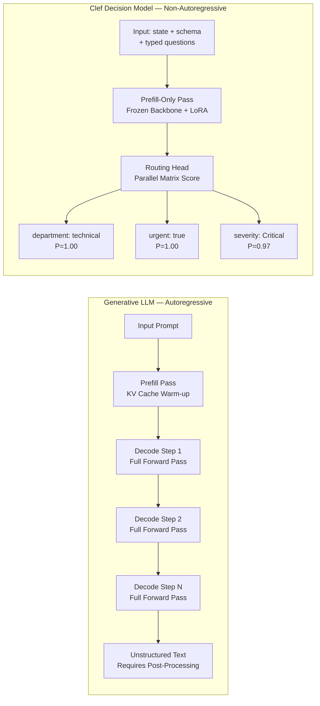
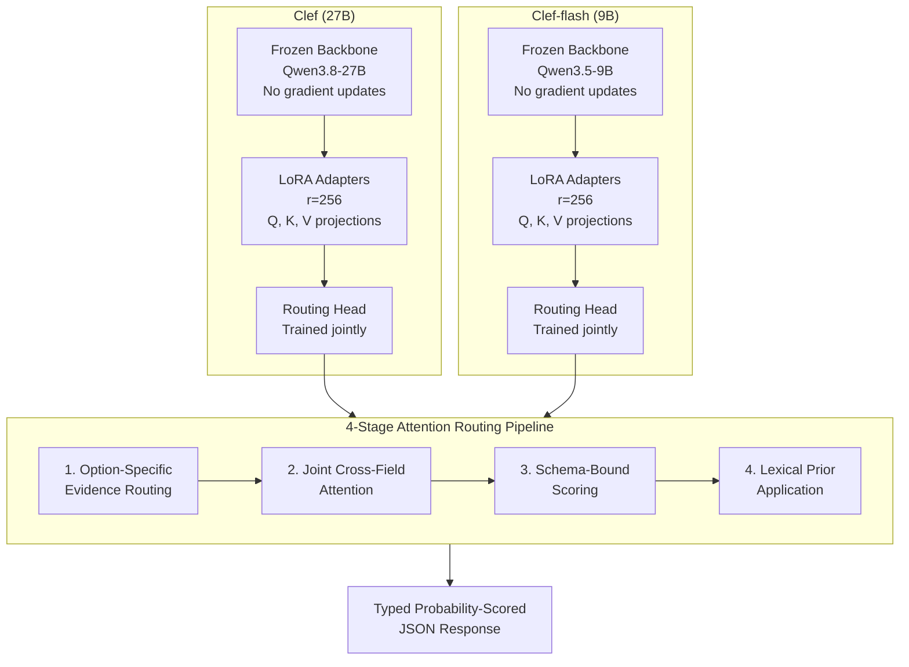
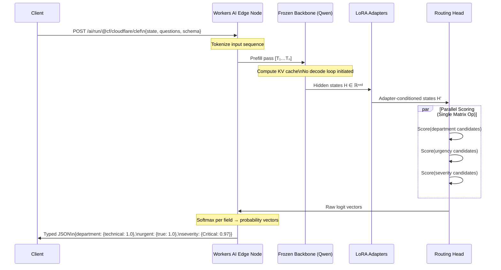
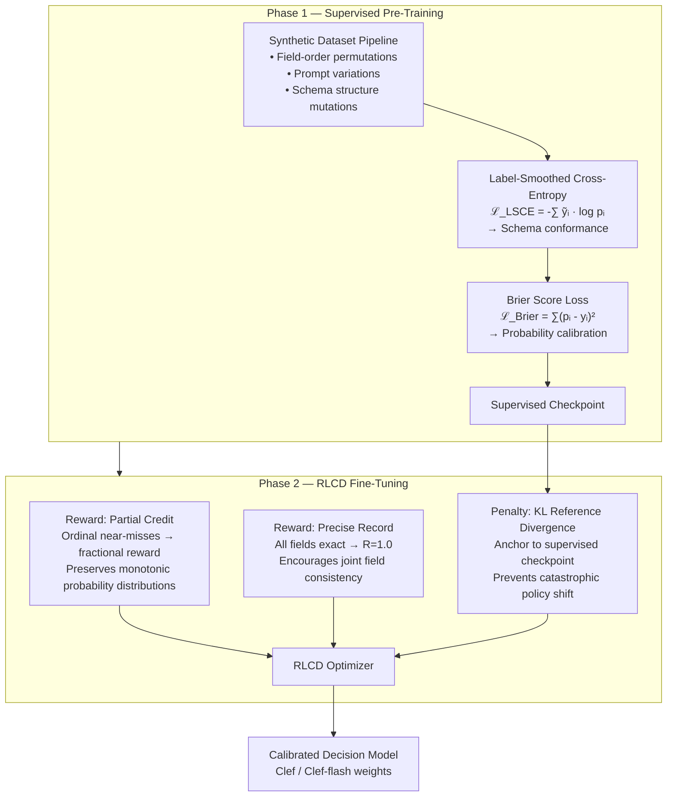
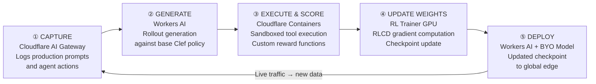
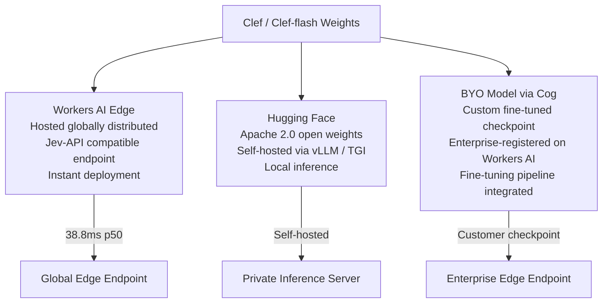

## A summary of findings by the original publishers
> **Authors:** Michelle Chen, Alex Reneau, Kevin Flansburg — Cloudflare\
> **Published:** October 1, 2026\
> **License:** Apache 2.0 (open weights on Hugging Face)\
> **Availability:** Hosted on Workers AI; weights runnable locally

---
## 1\. Introduction and Motivation

Cloudflare's release of **Clef** and **Clef-flash** marks the company's first in-house trained models shipped through its Workers AI platform. This is not an incremental iteration on existing hosted LLM offerings — it represents a deliberate architectural departure from generative language model paradigms toward a class Cloudflare calls _decision models_: inference engines whose sole purpose is to evaluate a typed, schema-constrained input and return a typed, probability-scored output, without generating any intermediate natural language.

The impetus for this design is grounded in the operational reality of agentic AI systems. In a multi-step agent loop where a planning LLM issues routing or classification calls, the accumulated latency of each call is multiplicative. A standard instruction-tuned LLM completing a classification task in the conventional way — generating a chain-of-thought and then a label — typically requires hundreds of milliseconds per call. At **524 ms** for Jev (Typesafe AI's decision baseline), an agent can execute fewer than two routing decisions inside a half-second budget. At **38.8 ms** for Clef-flash, that expands to over a dozen. This is the design constraint Clef is built to resolve.

Equally important is the calibration requirement. In structured automation — where a misrouted support ticket, an incorrectly prioritized alert, or a miscategorized domain can have downstream system consequences — probability scores must be _statistically reliable_, not just directionally correct. A model that outputs `0.97` confidence should be wrong approximately 3% of the time, not 20%. Calibrating confidence under constrained output distributions requires separate loss objectives beyond cross-entropy, which Clef addresses through its RLCD training regime.

This article performs a complete technical teardown of the Clef system: its architecture, training objectives, inference mechanism, schema primitives, benchmark methodology, enterprise fine-tuning loop, and deployment topology.

---

## 2\. Decision Models vs. Generative LLMs

The foundational distinction is in _output space_ and _inference mechanism_.

A generative LLM operates over a token vocabulary of \~100,000+ tokens and produces output by autoregressively sampling one token conditioned on all previous tokens. Classification and structured extraction are emergent behaviors, not native output modalities. A prompt like _"Classify the following support ticket by department"_ will produce a sequence of tokens such as `T`, `e`, `c`, `h`, `n`, `i`, `c`, `a`, `l` — passing through a decode step for each, paying a full forward pass through the transformer stack for every output token. The output format must then be post-processed: JSON extraction, format validation, schema enforcement.

A decision model inverts this contract entirely.

> _"The decision step is non-autoregressive … no intermediate text to generate token by token."_

The model receives the input (state, instructions, schema), runs a single prefill pass through its backbone, and then scores all candidate schema targets _simultaneously in one matrix operation_. The decode loop is eliminated. Latency is determined by input sequence length and model capacity, not by output length.




The key properties that follow from this architecture are:

**Output-length-invariant latency.** A generative LLM classifying into 3 categories vs 50 categories has the same throughput cost because the token count of the label varies negligibly. But a decision model is indifferent to the number of categories — it scores them all in a single matrix multiply regardless of count.

**Native schema conformance.** Because the output space is constrained to exactly the options defined in the schema, schema violation is architecturally impossible. There is no need for structured output coercion via tool-calling hacks, regex extraction, or retries.

**Calibrated probabilities as first-class outputs.** Rather than returning a single argmax label, Clef returns probability distributions over all candidates for every question field. This enables downstream systems to implement confidence thresholds, human-in-the-loop escalation, or soft routing logic without post-hoc calibration.

**Simultaneous multi-field inference.** A single API call evaluates multiple schema fields — routing department, urgency flag, and severity score — all in one forward pass. With a generative LLM this would require either a complex structured output prompt or multiple serial calls.

---

## 3\. Model Architecture

Clef ships as two models with different accuracy/latency tradeoffs:

| Model | Base Backbone | Parameter Scale | Optimization Target |
| --- | --- | --- | --- |
| **Clef** | Qwen3.8-27B (frozen) | \~27B base + LoRA r=256 | Precision, multi-hop tasks, vision |
| **Clef-flash** | Qwen3.5-9B (frozen) | \~9B base + LoRA r=256 | Ultra-low latency, high-throughput |

The architecture follows a **parameter-efficient post-training** paradigm:




### 3.1 Frozen Backbone

Both Clef and Clef-flash use frozen base model weights. No gradient updates flow into the Qwen backbone parameters during post-training. This is a deliberate choice that serves several engineering goals:

* **Stability.** Large-scale backbones are expensive to catastrophically destabilize. Keeping them frozen eliminates the risk of forgetting broad language understanding capabilities.

* **Efficiency.** With frozen weights, only LoRA delta matrices and the routing head require optimizer state during training, reducing GPU memory requirements significantly.

* **Composability.** The backbone remains a general-purpose feature extractor; the routing head is the task-specific component, making it independently replaceable without retraining the full stack.

The Qwen family selection is notable. Qwen3.8-27B (27B parameters) provides the depth needed for complex multi-hop classification and multi-modal understanding. Qwen3.5-9B (9B parameters) provides sufficient representational capacity for high-confidence single-domain routing at dramatically lower inference cost.

### 3.2 Low-Rank Adapters (LoRA, rank r=256)

LoRA adapters inject trainable low-rank decomposition matrices into specific projection layers of the transformer attention mechanism. Given a frozen weight matrix `W₀ ∈ ℝᵈˣᵏ`, LoRA parameterizes the delta as:

```
ΔW = BA   where B ∈ ℝᵈˣʳ, A ∈ ℝʳˣᵏ, r << min(d, k)
```

At rank `r=256`, Clef uses a notably high rank compared to typical LoRA applications (r=4–64). This reflects the precision requirements of decision routing: the adapters must encode sufficient representational expressivity to distinguish fine-grained semantic differences in schema candidates — for example, distinguishing `billing_dispute` from `billing_inquiry` from `invoice_request` in a customer service taxonomy.

During inference, the LoRA delta is folded into the weight matrix:

```
W_eff = W₀ + BA
```

This means there is zero inference-time overhead compared to using the base model weights directly — the LoRA computation is absorbed into the weight matrix at load time.

### 3.3 Routing Head and 4-Stage Attention Routing

The routing head is a trainable component that operates on the contextualized hidden states produced by the frozen backbone (conditioned through LoRA adapters). Its architecture processes schema-conditioned representations through four functional stages:

**Stage 1 — Option-Specific Evidence Routing:** Extracts and emphasizes token-level evidence from the input that is relevant to each individual schema option. This is a form of guided attention that conditions hidden states on the identity of the candidate being scored.

**Stage 2 — Joint Cross-Field Attention:** Models dependencies across schema fields simultaneously. When classifying `department` and `urgency` jointly, a correctly routed `department=technical` signal should inform and sharpen the confidence distribution over `urgency`. This cross-field attention is what enables Clef to outperform approaches that classify each field independently.

**Stage 3 — Schema-Bound Scoring:** Projects the attended representations into a score vector whose dimension equals the number of valid candidates for each schema field. This projection is where schema constraint enforcement happens structurally — the output space is exactly the schema, not the full token vocabulary.

**Stage 4 — Lexical Prior Application:** Applies a learned prior based on surface-form lexical features of the candidate labels. This regularizes confidence distributions in low-evidence situations — preventing overconfident misclassification when the input provides insufficient discriminating signal for a given field.

### 3.4 Extended Capabilities (Clef Only)

Clef carries two capabilities not present in Clef-flash:

**64k context window.** Clef's context window is double that of Jev (32k). For use cases like classifying long-form support transcripts, classifying API traces, or routing complex multi-turn conversations, this eliminates the need to chunk and aggregate results across truncated windows.

**Vision encoder.** Clef includes a multi-modal vision encoder enabling direct classification of visual content — web page screenshots, document images, diagrams — without a separate OCR or VLM preprocessing step. This is directly relevant to the threat intelligence case study detailed in Section 9.

---

## 4\. Non-Autoregressive Inference Engine

The inference-time behavior of Clef is its most significant engineering departure from standard language model serving.




### 4.1 Prefill-Only Execution

Standard autoregressive inference involves two phases:

1. **Prefill:** Process the full input sequence in parallel, building the KV cache.

2. **Decode:** Autoregressively sample output tokens, one at a time, each requiring a full forward pass through the transformer.

Clef executes only Phase 1. After the prefill pass, the routing head reads the contextualized hidden states at the final input position and scores all schema targets in a single batched matrix multiplication. The decode phase is entirely absent.

The consequence is that Clef's time-to-first-output equals its time-to-complete-output. There is no streaming, no token-by-token emission, and no decode-phase GPU utilization. This characteristic makes Clef fundamentally different to serve efficiently: the compute profile is dominated by prefill-phase memory bandwidth and matrix multiply throughput, not by the decode-phase memory bandwidth per token that dominates LLM serving.

### 4.2 Computational Complexity Comparison

For an autoregressive LLM producing `L` output tokens with a transformer of depth `D` layers and hidden dimension `d`:

* **Prefill cost:** `O(n² · d · D)` (quadratic in sequence length due to self-attention)

* **Decode cost per token:** `O(n · d · D)` (linear in sequence length, but repeated `L` times)

* **Total decode cost:** `O(L · n · d · D)`

For Clef:

* **Prefill cost:** `O(n² · d · D)` (identical)

* **Routing head scoring:** `O(C · d)` where `C` is the total number of schema candidates across all fields — typically small (tens to low hundreds)

* **Total output cost:** `O(C · d)` — essentially zero compared to prefill

In practice, at `n ≈ 512` tokens (a typical support ticket + schema), `d = 4096` (Qwen hidden dim), the prefill-phase cost is already computed. The routing head adds a negligible constant. A standard LLM generating a 50-token response then adds 50 sequential decode steps.

### 4.3 Latency-Determinism Property

A structurally important property of Clef's inference mode is **output-length-determinism**: the inference latency has zero dependency on the number of schema candidates or the length of the answer. Whether you define 3 categories or 300 categories, whether the answer is `Yes` (1 token) or `billing_dispute_complex_international` (5 tokens), the latency is identical. The routing head scoring scales in `O(C · d)`, where `C` is trivially small relative to `n · d`.

This property is essential for latency guarantees in agentic hot paths — you can bound Clef's latency at the p99 level in ways that are fundamentally impossible with autoregressive generation.

---

## 5\. Training Methodology and RLCD

Clef's training pipeline is two-phased: supervised pre-training using a multi-objective loss function, followed by RLCD (Reinforcement Learning for Calibrated Decisions) fine-tuning.




### 5.1 Synthetic Dataset Generation

Clef was trained on synthetically generated data constructed through systematic permutations of:

* **Field ordering.** Schema field order is randomized across training examples, ensuring the model cannot exploit positional priors.

* **Prompt surface form.** Multiple phrasings of the same instruction are generated to prevent overfitting to specific prompt templates.

* **Schema structure.** Number of fields, number of candidates per field, and mixture of field types (`bool`, `choice`, `score`) are varied.

This approach ensures that the routing head learns task semantics (the relationship between input evidence and schema candidates) rather than dataset artifacts.

### 5.2 Label-Smoothed Cross-Entropy (LSCE)

The primary classification loss uses label smoothing to prevent pathological overconfidence:

```
ỹᵢ = (1 - ε) · yᵢ + ε/K

ℒ_LSCE = -∑ᵢ ỹᵢ · log pᵢ
```

where `K` is the number of candidates, `ε` is the smoothing coefficient, `yᵢ` is the hard label indicator, and `pᵢ` is the model's predicted probability for candidate `i`.

Label smoothing has two effects relevant to decision routing: it prevents the model from assigning exactly `1.0` probability to any candidate (which would be pathologically overconfident), and it regularizes the output distribution to remain non-zero for plausible alternatives, which aids in downstream confidence-threshold logic.

### 5.3 Brier Score Loss

The Brier score is a strictly proper scoring rule for probability calibration:

```
ℒ_Brier = ∑ᵢ (pᵢ - yᵢ)²
```

Minimizing the Brier score directly incentivizes calibrated probabilities — the model is penalized quadratically for overconfidence as much as for underconfidence. A model trained only with cross-entropy can learn to be _discriminative_ (correctly ranking candidates) without being _calibrated_ (assigning accurate probabilities). The Brier loss explicitly targets the calibration objective.

The practical consequence: when Clef outputs `P(urgent=true) = 0.95`, this is a statistically reliable estimate, not just a soft argmax. Systems downstream can safely apply a threshold of `0.8` to gate human escalation without ad-hoc recalibration.

### 5.4 RLCD: Reinforcement Learning for Calibrated Decisions

RLCD is applied as a secondary optimization phase starting from the supervised pre-trained checkpoint. It defines three reward/penalty signals:

**Partial Credit for Ordinal Choices.** For `score` type fields where candidates represent an ordinal scale (e.g., `[No Impact, Minor, Major, Critical]`), standard RL rewards are binary — correct or incorrect. This is destructive for calibration: it treats predicting `Major` when the true label is `Critical` as identically bad to predicting `No Impact`. RLCD applies a fractional reward proportional to ordinal distance:

```
r_ordinal = 1 - (|predicted_rank - true_rank|) / (K - 1)
```

This reward structure preserves the monotonic probability distribution over ordinal scales: the model learns that adjacent errors are more acceptable than distal errors, which directly shapes the calibration of non-argmax candidates.

**Precise Record Output Reward.** For multi-field schema records, the full reward `R=1.0` is granted only when all predicted fields exactly match the ground truth. This is a joint accuracy signal that encourages _co-consistency_ across fields: if `department=technical` is predicted correctly but `severity=Minor` is predicted when the true value is `Critical`, no full reward is granted. This is critical because real-world routing decisions are conjunctive — routing a ticket to the right team with the wrong priority can be as costly as routing to the wrong team entirely.

**Reference Penalty (KL Divergence).** To prevent the RL policy from drifting catastrophically from the supervised pre-training distribution, a KL-divergence penalty anchors the RL-optimized policy to the supervised checkpoint:

```
r_total = r_ordinal + r_record - β · KL(π_RL || π_SFT)
```

where `π_SFT` is the supervised fine-tuned policy and `β` is a coefficient controlling the strength of the anchoring. This is analogous to the RLHF/PPO reference policy penalty used in reward-modeled LLM fine-tuning, adapted for the decision model regime.

---

## 6\. Schema System and API Design

The Clef API is designed around a typed question schema that maps directly to the three reward mechanisms in RLCD training.

### 6.1 Request Structure

```bash
curl -X POST "https://api.cloudflare.com/client/v4/accounts/$ACCOUNT_ID/ai/run/@cf/cloudflare/clef" \
  -H "Authorization: Bearer $CLOUDFLARE_AUTH_TOKEN" \
  -H "Content-Type: application/json" \
  -d '{
    "model": "clef",
    "state": "Checkout has been failing for every customer for the last hour.",
    "questions": {
      "urgent": {
        "type": "bool",
        "instructions": "Is this support request urgent?"
      },
      "team": {
        "type": "choice",
        "instructions": "Which team should handle this request?",
        "criteria": {
          "billing": "Payments, invoices, and refunds",
          "technical": "Outages, errors, and configuration",
          "sales": "Plans and upgrades"
        }
      },
      "severity": {
        "type": "score",
        "instructions": "How severe is the customer impact?",
        "criteria": ["No impact", "Minor", "Major", "Critical"]
      }
    }
  }'
```

### 6.2 Question Types and Their Computational Semantics

The three question types correspond directly to distinct routing head output configurations and different RLCD reward structures:

**`bool`** — Binary field. Output is a probability distribution over `{true, false}`. Trained with standard binary cross-entropy. Used for threshold-gated decisions.

**`choice`** — Categorical field with key-value pairs. Keys are programmatic identifiers; values are natural language descriptions that form the context against which input evidence is scored. The routing head scores each key, and the natural language description is encoded into the evidence routing stage of the attention pipeline. The key/value separation allows the schema designer to provide rich discriminating context to the model while keeping the output programmatically consumable. Trained with LSCE.

**`score`** — Ordinal field with an ordered list of candidates. The list order is semantically meaningful — it encodes the ordinal relationship the routing head uses in RLCD partial credit computation. Trained with LSCE + ordinal partial credit reward.

### 6.3 Multi-Field Inference Efficiency

All questions in a single request are evaluated in a single inference pass. The routing head simultaneously computes scores for all fields through the joint cross-field attention mechanism. This is not a trivial implementation detail — it means the cost of adding additional schema fields is near-zero after the first field, because the attention computation is shared across the entire question set.

The practical limit on questions per call is not yet publicly disclosed. However, the mechanism implies diminishing marginal latency cost per additional field.

### 6.4 Jev API Compatibility

The Clef API is designed to be a drop-in replacement for the Jev API format. Existing systems using Jev can substitute the endpoint URL and account credentials without modifying the request schema. This minimizes integration friction for teams evaluating migration.

---

## 7\. Benchmark Performance

Clef was evaluated across **43 benchmarks** spanning tool use, domain classification, intent detection, and multi-field record extraction. The following subsections analyze the most technically informative results.

### 7.1 Latency Benchmarks

The latency measurements below were collected on Cloudflare's production edge infrastructure under consistent conditions:

| Model | Median (p50) | p95 | Spread | p50 vs Jev |
| --- | --- | --- | --- | --- |
| **Clef-flash** | **38.8 ms** | 122.4 ms | 83.6 ms | **13.5× faster** |
| Kev-9B | 51.4 ms | 187.9 ms | 136.5 ms | 10.2× faster |
| DiffusionGemma Jev | 84.4 ms | 211.2 ms | 126.8 ms | 6.2× faster |
| Laya | 5.8 ms | 222.5 ms | 216.7 ms | — (unstable p95) |
| **Clef** | **209.3 ms** | 238.6 ms | 29.3 ms | **2.5× faster** |
| Jev (baseline) | 524.1 ms | 536.0 ms | 11.9 ms | 1× |

```mermaid
gantt
    title p50 Latency Comparison (lower = better)
    dateFormat X
    axisFormat %s ms

    section Models
    Clef-flash  (38.8ms)  : 0, 39
    Kev-9B      (51.4ms)  : 0, 51
    DiffGemmaJev(84.4ms)  : 0, 84
    Clef        (209.3ms) : 0, 209
    Jev         (524.1ms) : 0, 524
```




**The Laya anomaly** deserves specific attention: Laya's median latency of 5.8 ms is faster than Clef-flash, but its p95 of 222.5 ms produces a spread of **216.7 ms** — by far the widest of any system. This tail behavior makes Laya unsuitable for latency-bounded agentic hot paths: the 95th percentile guarantee is worse than Clef by nearly 100 ms. Clef's p95 of 122.4 ms at a spread of 83.6 ms is operationally more valuable despite the higher median.

**The Clef p95 insight:** Clef's spread of only 29.3 ms (p50=209.3, p95=238.6) is the tightest among all tested systems except Jev. This tight spread reflects the deterministic nature of the non-autoregressive inference path — there is no token-count variance introducing stochastic latency.

### 7.2 Quality Benchmarks

Selected results from the 43-benchmark evaluation suite:

| Benchmark | Clef | Clef-flash | Jev | Leader |
| --- | --- | --- | --- | --- |
| **BFCL Accuracy** | 98.47% | **98.76%** | 95.75% | Clef-flash |
| **ToolRet nDCG@10** | **69.19** | 66.43 | 65.28 | Clef |
| **API-Bank Accuracy** | 91.93% | **93.11%** | 88.19% | Clef-flash |
| **BANKING77 macro-F1** | **94.20** | 90.93 | 79.74 | Clef |
| **CLINC150+OOS macro-F1** | **97.43** | 66.77 | 89.27 | Clef |
| **Home Appliances Exact** | 82.95% | **97.73%** | 52.27% | Clef-flash |
| **Invoice Processing** | **64.7** | — | 61.8 | Clef |
| **Customer Service** | **76.3** | — | 76.0 | Clef |
| **Security Incidents** | **62.9** | — | 61.7 | Clef |
| **Agent Trace Observability** | 68.5 | — | **71.6** | Jev |
| **When2Call Accuracy** | 72.37% | — | **80.97%** | Jev |
| **BRIGHT nDCG@10** | 45.91 | — | **47.52** | Jev |
| **PhishNChips Accuracy** | 79.60% | — | 85.35% (DiffGemma) | DiffGemma Jev |

### 7.3 Analysis: Where Clef Wins and Why

**BFCL (Berkeley Function Calling Leaderboard):** Clef-flash at 98.76% surpasses Jev's 95.75% by a significant margin. BFCL tests function selection, argument extraction, and API call completion — exactly the structured decision-making scenario Clef is optimized for. The BFCL improvements reflect the effect of LoRA-adapted hidden states tuned specifically for schema-structured input/output.

**BANKING77 and CLINC150:** Both are intent classification benchmarks with dense, semantically similar categories (77 banking intents, 150 clinc intents + out-of-scope). Clef's BANKING77 advantage (94.20 vs 79.74) is 14.46 F1 points — a substantial margin. The CLINC150 result shows a sharp split: Clef at 97.43, Jev at 89.27, but Clef-flash at only 66.77. This is a known tradeoff of smaller model capacity: the flash model lacks sufficient representational depth to discriminate 150+ fine-grained intent categories reliably.

**When2Call (Jev leads):** This benchmark tests whether a model correctly identifies _when_ to invoke a tool vs. when to respond without tool use. Jev's superiority here (80.97% vs 72.37%) may reflect that this capability is more naturally aligned with how generative LLMs learn function-calling discipline — through chain-of-thought reasoning about tool necessity. Clef's non-autoregressive scoring pathway may lack the intermediate reasoning step that helps discriminate on-the-fence cases.

**Transparent disclosure:** The Clef team explicitly disclosed benchmarks where competitors lead. This is methodologically significant — a benchmark suite selectively reporting only favorable results is a common failure mode in model comparison. The inclusion of When2Call, BRIGHT, and PhishNChips as Jev/DiffusionGemma wins gives the comparative analysis greater credibility.

### 7.4 The Agentic Loop Calculation

A critical systems-level insight from the latency data:

```
Budget per agent step: 500 ms (practical UX threshold)

Clef-flash serial calls at p50: floor(500 / 38.8) = 12 routing decisions
Jev serial calls at p50:        floor(500 / 524.1) = 0 routing decisions (requires >1 step budget)

Clef serial calls at p95:       floor(500 / 122.4) = 4 routing decisions
Jev serial calls at p95:        floor(500 / 536.0) = 0 routing decisions
```

This difference is qualitative, not quantitative. With Jev, multi-step agentic routing within a single user-perceptible time window is architecturally infeasible. With Clef-flash, it is a first-class design primitive.

---

## 8\. RL Fine-Tuning Pipeline

Beyond the base Clef models, Cloudflare has announced a closed-loop RL fine-tuning infrastructure for enterprise customers to train custom decision models on their own data and reward signals.




### 8.1 The Five-Stage Pipeline

**Stage 1 — Capture (AI Gateway).** Cloudflare's AI Gateway serves as a universal proxy for AI API traffic. In the fine-tuning context, it captures production prompts, schema definitions, model outputs, and agent action sequences. This creates a continuous stream of training signal from live system behavior — critically, training on the actual input distribution the model will face in production, not a separate curated dataset.

**Stage 2 — Generate (Workers AI).** The current base Clef policy generates candidate rollouts against the captured production prompts. For decision model training, rollouts are straightforward: given a prompt and schema, generate the probability distribution. In more complex agentic fine-tuning scenarios, rollouts may include multi-step tool-use trajectories where each step involves a Clef decision call.

**Stage 3 — Execute and Score (Cloudflare Containers).** This is the reward computation stage. Cloudflare Containers spin up sandboxed environments where:

* Custom reward functions defined by the enterprise customer are executed against the generated rollouts.

* Automated test suites validate rollout correctness.

* For agentic workloads, tool execution is simulated or run in a sandboxed context to evaluate end-to-end task completion.

The key design principle is that reward definition is customer-controlled. A customer routing support tickets can define rewards based on whether human agents subsequently escalated or resolved the routed ticket. A customer classifying security incidents can define rewards based on whether the classified severity matched subsequent remediation urgency.

**Stage 4 — Update Weights (RL Trainer).** GPU-backed RL training compute processes the scored rollouts, computes RLCD gradients, and updates the LoRA adapter weights and routing head. The frozen backbone remains unchanged — only the efficient-parameter components are updated.

**Stage 5 — Deploy (Workers AI + BYO Model).** Updated checkpoints are packaged using Replicate's Cog format (a container-based model packaging standard) and deployed to the Workers AI edge network. The BYO (Bring Your Own Model) pathway means customers can serve fine-tuned models without Cloudflare requiring access to the checkpoint contents — consistent with the enterprise data isolation policy.

### 8.2 Rollout Strategy

The closed-loop design is an instance of **online RL from production data** — a training paradigm that is architecturally more demanding but statistically more efficient than offline training:

* **Distribution alignment:** Training data is always drawn from the current model's behavior distribution in the current production environment. This avoids distribution shift between training and serving.

* **Continuous adaptation:** As the fine-tuned model improves, it generates better rollouts, which produce more informative training signal for the next update cycle.

* **Reward integration:** Business-specific reward signals (e.g., downstream task completion rates, human override frequencies, escalation patterns) can be integrated without any public data exposure.

### 8.3 Enterprise Data Isolation Policy

> _Cloudflare commits not to read, store, or train on customer request/response data unless explicitly enrolled in the custom fine-tuning product._

This is a structural guarantee, not a policy statement. The AI Gateway logging, the rollout generation, and the reward computation all operate within customer-enrolled contexts. Customers not enrolled in fine-tuning are not subject to any data capture at the training pipeline layer.

### 8.4 Deployment Phases

**Phase 1 (Active):** Hands-on partnership engagements with Cloudflare's Forward-Deployed Engineer (FDE) team. This is a white-glove deployment model where Cloudflare engineers assist in defining reward functions, curating training data, and evaluating fine-tuned model quality.

**Phase 2 (Planned):** Self-serve train-and-redeploy platform. Customers will define schemas, reward functions, and training configuration through a managed UI/API, with the full pipeline executing autonomously.

### 8.5 Historical Attribution: vLLM DiffusionGemma Origins

The Clef fine-tuning platform builds on earlier experimental work by researcher **Matt Mastracci**, who explored adapting DiffusionGemma as a decision model via LLM logprob extraction and submitted upstream pull requests to the vLLM project. This path informed the non-autoregressive scoring architecture ultimately implemented in Clef — specifically, the recognition that logprob-weighted parallel scoring over a constrained token set is a viable high-performance alternative to full generative decoding for classification tasks.

---

## 9\. Threat Intelligence Case Study

Cloudflare's internal threat intelligence team evaluated Clef for automated website domain classification — a high-volume, latency-sensitive classification task directly tied to security policy enforcement.

### 9.1 Workload Description

The classification pipeline uses Cloudflare's internal "Browser Run" tool: a headless browser automation system that fetches and renders web pages — including JavaScript execution — and produces a combined visual/text representation of the page. This rendered representation is then passed to a decision model for domain classification.

The classification schema is multi-label, multi-confidence — a domain may simultaneously score high on `fashion website` (0.95) and `ecommerce` (0.85) while scoring near-zero on `phishing` (<0.01). This is exactly the multi-field probability distribution use case Clef is architected for.

### 9.2 End-to-End Performance

| Pipeline | Total End-to-End Latency | Notes |
| --- | --- | --- |
| **Clef pipeline** | **2.2 seconds** | Browser render + Clef visual classification |
| **GPT-OSS-120B baseline** | **4.7 seconds** | Browser render + generative LLM classification |

The 2× end-to-end improvement is dominated by the model inference step, not browser rendering time. The Clef decision step itself contributes \~209 ms (the Clef p50); the remainder is headless browser rendering overhead shared between both pipelines.

Additionally, the Clef pipeline returned **more classifications per call** — the multi-field schema enables simultaneous output of multiple domain categories in a single pass, whereas the generative LLM produced fewer distinct classification outputs per invocation.

### 9.3 Vision Encoder Relevance

The vision encoder in Clef (absent in Clef-flash) is directly exercised in this use case. Web page classification from screenshots requires visual feature extraction — rendered layout, color scheme, logo presence, image content — that purely text-based models cannot capture after OCR flattening. The vision encoder allows Clef to classify visual content directly from the rendered page image alongside the extracted text, without a separate VLM preprocessing step.

---

## 10\. Open-Source Strategy and Deployment Topology

### 10.1 License

Both Clef and Clef-flash weights are released under the **Apache 2.0 license**. This permits:

* Commercial use without restriction

* Modification and redistribution of model weights

* Integration into proprietary products without source disclosure

This is a maximally permissive license for model weights, positioning Clef as a serious option for self-hosted enterprise deployments.

### 10.2 Deployment Options



**Workers AI hosted:** Globally distributed on Cloudflare's edge network across 300+ cities. Near-user inference means latency is geographically bounded — the 38.8 ms p50 is measured on the distributed infrastructure, not a single datacenter.

**Hugging Face self-hosted:** For organizations with data residency requirements or those needing to run inference without external network dependencies, the Apache 2.0 weights can be loaded locally. Specific hardware requirements and VRAM estimates for self-hosted deployment were not disclosed at launch.

**BYO Model (Cog-packaged):** Fine-tuned enterprise checkpoints are packaged in Replicate's Cog format and registered on Workers AI. This pathway allows enterprises to serve proprietary decision models on Cloudflare infrastructure without Cloudflare having access to the model's interior.

### 10.3 Strategic Positioning

Clef is Cloudflare's first model trained by the Workers AI team and represents a deliberate move toward becoming what the company terms _"The Agent Cloud"_ — infrastructure purpose-built for agentic AI workloads, not retrofitted general-purpose hosting.

The release of open weights under Apache 2.0 is a trust-building mechanism: external researchers can audit the model, reproduce benchmark results, and build on the architecture. The reproducibility claim — falsifiable via open weights — is a meaningful differentiation from proprietary decision model providers.

---

## 11\. Implications for Agentic System Design

### 11.1 Rethinking the Routing Architecture

Conventional agentic frameworks place routing logic inside the planning LLM: the same model that generates prose also decides what tool to call, in what order, with what priority. This collapses two fundamentally different computational problems into one model: generation and classification.

Clef enables _decomposed agency_: route with a decision model, generate with a language model. Each component is optimized for its specific computational primitive. The planning LLM never sees routing questions; Clef never generates prose. The result is a system where routing decisions are 10–100× faster and statistically calibrated, while the planning LLM's capacity is fully dedicated to generation tasks.

### 11.2 Confidence-Threshold Gating

Because Clef outputs calibrated probability distributions, agentic systems can implement **confidence-threshold routing**: forward low-confidence decisions to a human operator or a higher-capacity model before acting.

```
if clef_response["urgent"]["true"] > 0.8:
    page_on_call_immediately()
elif clef_response["urgent"]["true"] > 0.5:
    send_standard_alert()
else:
    queue_for_morning_triage()
```

This pattern is not available with non-calibrated classifiers where `P=0.9` might represent a miscalibrated `P=0.6`. RLCD's calibration objective makes threshold gating statistically grounded.

### 11.3 Parallel Decision Trees

A pattern that becomes viable at 38.8 ms latency is **parallel decision trees**: multiple routing decisions executed simultaneously across different schema dimensions before any downstream action is taken.

At 524 ms latency per call, a 3-field parallel batch requires 1.57 seconds. At 38.8 ms, a 3-field batch completes in 38.8 ms (they're evaluated in one pass). For a 5-question schema, the latency is still 38.8 ms.

This changes system architecture: instead of sequential routing logic, all routing decisions can be materialized simultaneously at the start of a workflow, with downstream execution conditioned on the complete decision record.

### 11.4 The Calibration → Trust Chain

Calibrated probabilities enable a class of system designs where trust is quantified and propagated. An agentic system accumulating uncertainty across multiple Clef routing calls can compute a joint confidence estimate for a multi-step decision sequence, and route the entire sequence to human review if the joint confidence falls below a threshold — even if each individual step was above threshold.

This is structurally impossible with non-calibrated classifiers or generative LLMs producing soft labels.

---

## 12\. What Remains Undisclosed

The Clef announcement is unusually transparent for a model release, but several engineering-critical details remain undisclosed as of publication:

| Detail | Status |
| --- | --- |
| Per-request / per-decision pricing | Not announced |
| GA vs Beta tier / rate limits | Not announced |
| Maximum questions per API call | Not announced |
| Exact Hugging Face repository names | Not announced |
| Self-hosted VRAM requirements (Clef/Clef-flash) | Not announced |
| Vision API specifications (image dims, batch limits, formats) | Not announced |
| Full LoRA training configuration (target layers, α, dropout) | Not announced |
| RLCD hyperparameters (β coefficient, learning rate, batch size) | Not announced |
| Ablation study / technical paper | Not yet released |
| "Browser Run" tool public availability | Not announced |
| Exact Qwen3.8-27B vs Qwen3.5-9B architectural diffs | Not clarified |

---

## 13\. Conclusion

Clef is a technically coherent and methodologically rigorous answer to a well-defined systems engineering problem: how to make classification and routing decisions in agentic AI systems fast enough to be composable within latency-bounded workflows.

The non-autoregressive inference engine eliminates the decode phase entirely, producing output-length-invariant latency that no autoregressive system can match at equivalent model scale. The RLCD training regime produces calibrated probability outputs — not just discriminative labels — enabling confidence-threshold gating, joint uncertainty propagation, and statistically grounded escalation logic. The enterprise RL fine-tuning pipeline closes the loop from production traffic to updated model weights without exposing customer data.

The 43-benchmark evaluation, with transparent disclosure of losses alongside wins, gives the performance claims unusual credibility. The open-source Apache 2.0 release of weights makes those claims reproducible and falsifiable.

For systems engineers building agentic infrastructure in 2026, Clef represents the first production-grade, edge-deployed, open-weight decision model designed explicitly for the hot-path latency requirements of autonomous agent loops. Whether as a hosted Workers AI endpoint or a self-hosted checkpoint, it sets a new reference point for what structured AI inference can look like when freed from the generative LLM paradigm.

---


_All benchmark data sourced from the Cloudflare Blog post "Introducing Clef: our open-source decision models, and new RL fine-tuning platform" (October 1, 2026). Model and benchmark names reflect terminology used in the original publication._
