## Introduction

Jev, produced by **Typesafe AI** ([typesafe.ai](http://typesafe.ai)), is not a large language model. It cannot write a sentence. It will not produce a chain-of-thought reasoning trace. What it will do is make semantic classification decisions at sub-300ms latency for a fraction of the cost of an LLM inference call — and it does so by fundamentally re-framing the inference problem.

The canonical framing: LLMs answer **essay questions**. Jev answers **multiple-choice tests**. That single constraint — forcing every decision into a structured label space rather than a free-form generation space — is the source of both Jev's extraordinary speed and its equally extraordinary limitations.

This document dissects nine production-grade use cases, analyzes the data flows, architectural decisions, latency characteristics, and cost trade-offs. Where relevant, code fragments are provided to anchor the discussion, but the emphasis is on engineering decisions, not implementations.

---

## Core Architecture

### The Generation Problem vs. the Classification Solution

Every LLM call you make today follows the same computational pattern: autoregressive token prediction. The model maintains a KV cache of the full context window, then iteratively samples from a softmax distribution over the vocabulary (typically 50,000–128,000 tokens) to predict each successive token. This is inherently sequential — token *n* cannot be computed before token *n − 1*.

For a 500-token output at 30 tokens/second, you are waiting 16–17 seconds. The cost scales linearly with output length. When what you actually need is a binary label, you are paying for 499 tokens of waste.

Jev collapses this entirely. Its inference pipeline:

1. Encodes the input context and a **structured question batch** in a single forward pass through an encoder architecture.

2. Passes the resulting representation through a lightweight multi-label **classification head** — one output neuron per possible answer.

3. Applies sigmoid (for independent binary labels) or softmax (for mutually exclusive categories) to produce a **probability distribution**.

4. Returns all scores simultaneously, in a single round-trip.

No autoregressive loop. No vocabulary-size softmax. No sequential dependency between answers. The entire inference completes in one forward pass.

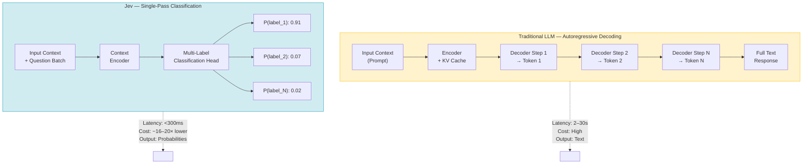


### The Structured Question API

The input contract with Jev consists of three question types, which must be provided in the prompt alongside the context:

| Type | Example | Returns |
| --- | --- | --- |
| **Binary (yes/no)** | "Is this email spam?" | Probability 0.0–1.0 |
| **Multi-class (pick-one)** | "Route to: \[billing, technical, refund, general\]" | Probability per class |
| **Score (0–1)** | "Rate urgency of this ticket" | Continuous 0.0–1.0 |

The consuming application applies thresholds to the returned probabilities. This threshold logic is **plain code** — the critical separation of concerns: Jev makes probabilistic judgements; your application makes deterministic decisions from those probabilities.

```python
# Threshold application pattern — the deterministic shell around Jev's probabilistic core
def route_support_ticket(jev_response: dict) -> str:
    if jev_response["ignore_probability"] > 0.85:
        return "discard"
    if jev_response["auto_reply_probability"] > 0.72:
        return "auto_reply"
    if jev_response["sentence_complete_probability"] < 0.60:
        return "await_more_input"
    return "human_queue"
```

This architecture means your business rules remain readable, testable, and auditable in version-controlled code rather than being buried in a model's latent reasoning.

### Latency and Cost Profile

Observed characteristics from production deployments discussed here:

* **Latency:** 100–300ms end-to-end for a typical classification batch

* **Cost vs. Kimi:** 16× cheaper at 7.2× higher throughput for equivalent classification tasks

* **Token efficiency:** 80% reduction in tokens consumed for memory-retrieval use cases (compared to naive LLM-based retrieval)

* **Cost model:** Billed per input token consumed by the classification context; no output token cost since probabilities are returned rather than generated text

---

## Integration Surface: APIs, Agent Frameworks, and Platforms

Jev is accessible through multiple integration paths:

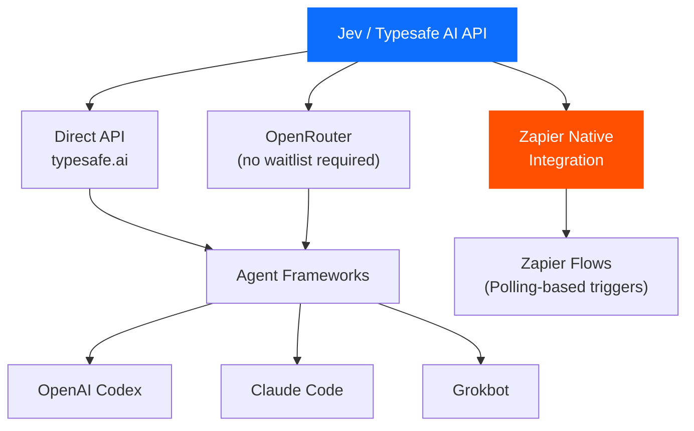


**Installation pattern for agent frameworks** (Codex / Claude Code / Grokbot): Navigate to [typesafe.ai](http://typesafe.ai) → Quickstart → copy the agent prompt → paste it into your agent workspace. Generate and store an API key. The agent framework handles the invocation contract; Jev is consumed as a tool/plugin in the agent's tool roster.

**OpenRouter fallback:** During Typesafe AI's intermittent waitlist periods, OpenRouter provides direct API access without gatekeeping. The API surface is identical; only the authentication and routing headers differ.

---

## Use Case 1 — High-Volume Email Triage

### Problem Statement

Categorizing and prioritizing large volumes of email is a fundamentally classification problem. Routing 500 emails through a traditional LLM at $0.01/1k tokens with \~200 tokens per classification = $1.00 per pass, with each call taking 1–3 seconds = 8–25 minutes of wall-clock time. Neither the cost nor the latency is acceptable for a near-real-time inbox assistant.

### How Jev Solves It

Jev treats each email as a classification context and evaluates a batch of questions against it simultaneously:

* "Does this require a human response? (yes/no)"

* "Route to: \[respond_today, respond_this_week, FYI_only, spam, promotional, automated\]"

* "Urgency score: 0–1"

* "Sentiment: \[neutral, frustrated, positive, urgent\]"

Each email generates a single Jev round-trip. At sub-300ms per email, 500 emails completes in approximately **90–150 seconds** — without parallelization. With aggressive concurrent batching (connection pooling + async dispatch), the same corpus reduces to under 30 seconds.

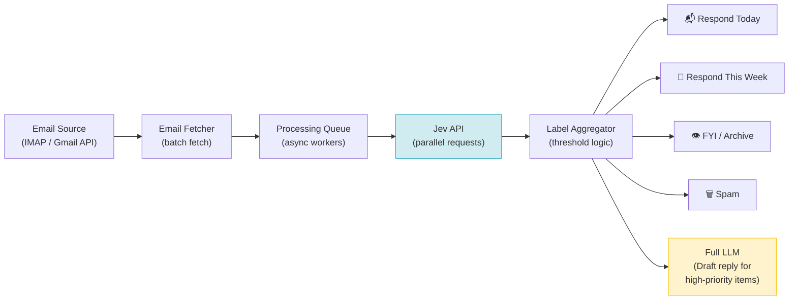


### Architectural Observations

The canonical pattern here is **Jev as a pre-filter, LLM as a writer**. Jev is not capable of drafting a reply — that requires an LLM. But Jev can determine which 10% of emails warrant LLM drafting, reducing LLM invocations from 500 to 50. Combined, the pipeline achieves high classification throughput and LLM-quality replies only where needed.

This "pre-filter + writer" pattern recurs across multiple use cases. Recognize it as a general compound inference architecture: **Classification → Selective Generation**.

### Engineering Considerations

* **Idempotency:** Email classification should be idempotent and stamped with a classification version. When your Jev prompt changes, old labels must be invalidated and recomputed.

* **Confidence gating:** Labels with probabilities between 0.45–0.55 represent genuine ambiguity. These should be routed to a human review queue rather than forced into a binary decision.

* **Feedback loops:** Store Jev predictions alongside ground-truth labels (as humans correct misclassifications). This dataset becomes training signal for future model fine-tuning.

---

## Use Case 2 — Voice-Controlled Browser Automation

### Problem Statement

Controlling a browser via natural language voice commands requires continuous real-time processing of partial speech input, understanding of the DOM state, and action dispatch with sub-second round-trip latency. A traditional LLM approach — encode the full DOM, send to GPT-4, parse the response, execute — has 2–10 second latency per action, making it perceptually unresponsive.

### System Architecture

The voice browser system described in the video comprises three discrete layers with clean data interfaces between them:

```mermaid
sequenceDiagram
    participant MIC as Microphone
    participant BROWSER as Browser Dashboard<br/>(Chrome Extension)
    participant NODE as Node.js Server
    participant JEV as Jev API
    participant TARGET as Controlled Browser<br/>(Puppeteer)

    MIC->>BROWSER: Audio stream (continuous)
    BROWSER->>BROWSER: Speech-to-Text (Web Speech API)<br/>Fragment emission every ~200ms
    BROWSER->>NODE: WebSocket: {fragment, timestamp}

    NODE->>TARGET: DOM scrape: extract up to 100 elements<br/>(id, text, type, position)
    NODE->>JEV: {fragment, dom_elements[], questions[]}

    JEV-->>NODE: Probability distribution<br/>(action_type, target_element, completeness, confidence)

    NODE->>NODE: Threshold evaluation<br/>(if p < 0.5 → ignore; if complete < 0.6 → wait)

    alt Action confirmed (p > 0.5, complete > 0.6)
        NODE->>TARGET: Puppeteer action (click, navigate, scroll, type)
        TARGET-->>NODE: Page state updated
    else Incomplete utterance
        NODE->>NODE: Buffer fragment, await more speech
    end
```


### The Jev Question Batch for Browser Control

The question batch sent to Jev on each speech fragment arrival contains approximately five structural questions:

| Question | Type | Purpose |
| --- | --- | --- |
| "What does the user want?" | Multi-class: \[navigate, click, scroll, type, search, none\] | Intent classification |
| "Which DOM element does the user mean?" | Pick-one from element list (up to 100) | Element selection |
| "Is the user addressing the browser (vs. someone in the room)?" | Binary | Noise filtering |
| "Is the utterance complete?" | Score 0–1 | Sentence boundary detection |
| "Should any pending action be cancelled?" | Binary | Command correction |

This is a **multi-task classification problem** solved in a single forward pass. A traditional LLM receiving the same inputs would need to reason through each question sequentially (or generate a structured JSON output that still requires autoregressive decoding). Jev answers all five simultaneously.

### DOM Summarization as Context Engineering

A critical design decision: the Node server does not pass the raw DOM to Jev. Instead, it constructs a **compact element manifest** — a numbered list of up to 100 actionable elements with their type, text, and position. This serves two functions:

1. **Context compression:** A full DOM serialization can be 50,000–200,000 tokens. The manifest stays under 2,000 tokens.

2. **Disambiguation surface:** Jev's "which element" question resolves against the manifest index, not a free-form description. This transforms fuzzy referring expressions ("the login button," "that blue link") into a concrete lookup.

```
Element manifest (abbreviated):
1. [LINK] "Wikipedia" — nav, href="/wiki/Main_Page"
2. [LINK] "English — 6,935,096 articles" — content, href="/wiki/Main_Page"  
3. [BUTTON] "Search" — toolbar, id="searchButton"
4. [INPUT] "Search Wikipedia" — toolbar, name="search"
...
```

The threshold engine then applies: "If `target_element_index == 3 AND action_type == click AND p > 0.7` → dispatch Puppeteer click on element 3."

### Engineering Observations

* **Latency budget breakdown:** Typical end-to-end latency from utterance fragment to browser action: 50ms (STT fragment) + 30ms (DOM scrape) + 100–200ms (Jev) + 20ms (Puppeteer) = **200–300ms total**. This is perceptually real-time for browser navigation.

* **The completeness score is critical:** Acting on an incomplete utterance ("go to wiki...") before the sentence is done produces jarring partial navigation. The completeness threshold (0.6 in the reference implementation) is the primary tuning parameter.

* **Session state management:** The Node server must maintain per-session DOM state snapshots. After each Puppeteer action, the DOM manifest must be refreshed before the next Jev query. Stale manifests cause element misidentification.

---

## Use Case 3 — Workflow Automation via Zapier

### Problem Statement

Zapier's trigger-action model is fundamentally a data routing system. The missing piece has always been **semantic routing** — making intelligent decisions about data at each node without requiring a full LLM invocation, which would be both slow and economically prohibitive at polling frequencies.

### Architecture: Jev as the Decision Node in a Zapier Flow

Zapier's native Jev integration positions Jev as a first-class action node in a Zap. The flow topology:

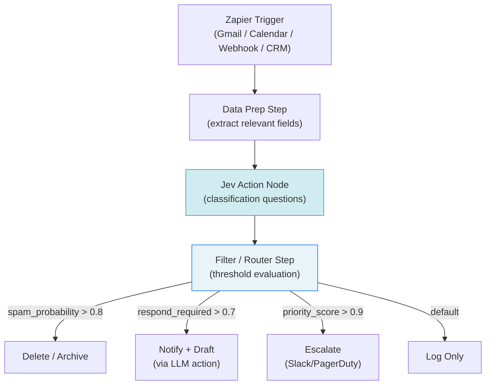


### Reference Implementation: Calendar Spam Detection

The concrete example from production: Zapier polls Google Calendar, sends each new event invite as context to Jev with the question "Is this calendar invite spam or promotional content rather than a legitimate meeting?" Jev returns a probability. The Zap's filter step routes high-confidence spam to automatic decline/deletion.

Key engineering insight: Calendar spam detection is not a keyword problem. "You have a voicemail" and "Don't miss this webinar" are syntactically benign but contextually spam. Jev's semantic understanding of the content — trained on broad language understanding — catches these where regex rules fail.

### Cost Model for Polling Architectures

At Zapier's polling frequencies (typically 1–15 minutes), a Jev call per event is economically viable in a way an LLM call is not:

| Model | Cost per call (est.) | Calls/day (500 items) | Daily cost |
| --- | --- | --- | --- |
| GPT-4o | \~$0.002 | 500 | \~$1.00 |
| Claude Haiku | \~$0.0003 | 500 | \~$0.15 |
| **Jev** | \~**$0.00006** | 500 | \~**$0.03** |

At Jev's cost tier, running classification on every incoming calendar event, email, or webhook payload is economically indistinguishable from free. This changes the architectural calculus: you no longer need to pre-filter what gets classified. **Classify everything.**

---

## Use Case 4 — Intelligent LLM Model Router

### Problem Statement

Multi-model architectures have been theoretically optimal for years — route simple tasks to cheap/fast models, complex tasks to expensive/capable models. In practice, the routing decision itself requires intelligence, and no fast, cheap way to make that decision existed. Using GPT-4 to decide whether to use GPT-4 is circular and expensive. Using keyword matching is brittle. Jev resolves this.

### Architecture

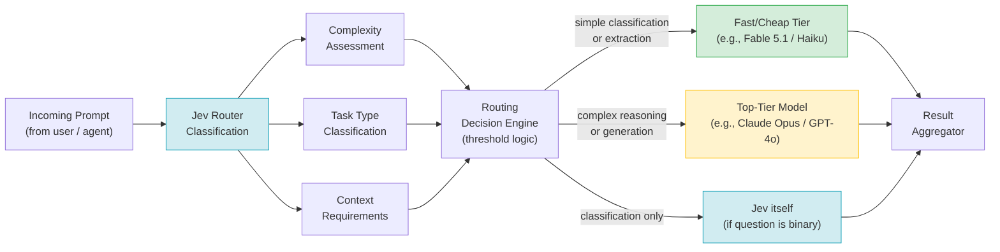


### The Routing Question Batch

For each incoming prompt, Jev evaluates a structured question set to determine the appropriate downstream model:

```
Context: [the user prompt]

Questions:
1. Does this prompt require multi-step reasoning? (yes/no)
2. Does this prompt require creative text generation? (yes/no)  
3. Task type: [classify, extract, summarize, generate, reason, code]
4. Context window requirement: [<2k tokens, 2k-8k tokens, >8k tokens]
5. Does this prompt have a definitively correct answer? (yes/no)
6. Is a partial or imperfect answer acceptable? (yes/no)
```

The routing table is then a set of threshold conditions on the returned probabilities. Prompts scoring low on multi-step reasoning, creative generation, and large context — while scoring high on extractive/classification tasks — route to the cheap tier.

### Observed Outcomes

From a 12-prompt benchmark (Claude-evaluated against dual-model output quality):

* **9 of 12 prompts** were correctly routed to the cheap model (Fable 5.1) without quality degradation

* **3 of 12 prompts** legitimately required the top-tier model

* **Cost savings: 70%** — because the top-tier model was only invoked where its capabilities were actually exercised

This result should be understood as a **lower bound** in production systems. Well-structured routing prompts and domain-tuned thresholds routinely achieve 60–80% cost reduction on mixed workloads.

### Agent Framework Integration Pattern

The reference implementation includes a toggle skill (`/jev`) that activates or deactivates the routing layer within an agent session. This is essential for:

1. **Debugging:** When unexpected routing occurs, disabling Jev exposes the underlying behavior.

2. **Testing:** Evaluating output quality with and without routing to measure degradation.

3. **Escape hatch:** Certain tasks require the top-tier model unconditionally; the skill provides an override.

---

## Use Case 5 — Customer Support Triage Engine

### Problem Statement

Inbound support volume creates a triage problem with three distinct complexity levels: discard (noise), automated response (template), and human escalation (genuine issue requiring empathy and judgment). The decision is almost always made on the first read of the subject line plus first sentence — a human triager uses perhaps 50 words of context to make this call. That is exactly the classification task Jev is optimized for.

### Architecture

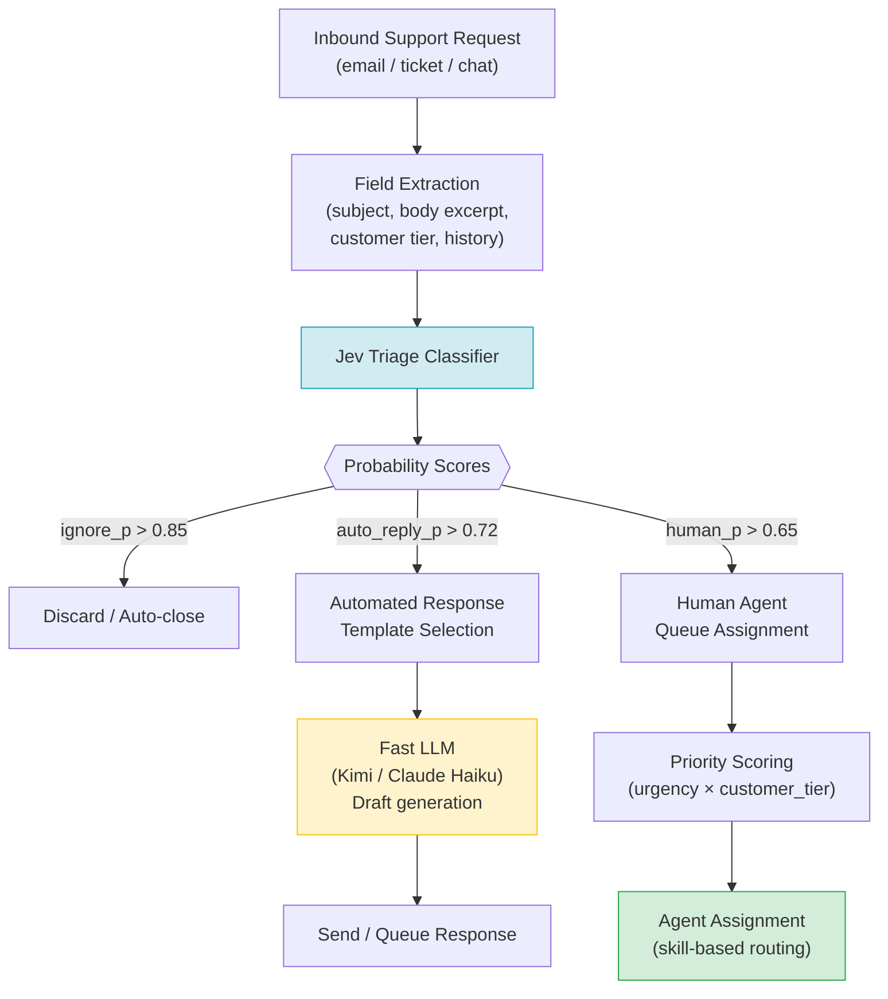


### Benchmark: Jev vs. Kimi (Comparable Cost Tier)

A direct A/B comparison of triage speed and cost on identical ticket sets:

| Metric | Kimi | Jev | Ratio |
| --- | --- | --- | --- |
| Time per triage decision | 8.38s | 1.16s | **7.2× faster** |
| Cost per 1,000 decisions | Baseline | 1/16th baseline | **16× cheaper** |

The 7.2× speed advantage is structurally guaranteed by the classification vs. generation architecture. Kimi (and any LLM used for classification) must generate a textual response that is then parsed. Jev returns probabilities directly.

The 16× cost advantage derives from the absence of output token costs. An LLM returning "HUMAN_QUEUE" generates 3 tokens. Jev returns a float. At scale (100,000 tickets/month), this difference is significant.

### The "Third Time Asking" Signal

A concrete example of contextual signal that Jev captures correctly: a support email with the subject "Third time asking about my broken export" contains no explicit escalation keyword, but the semantic content — repetition, ownership attribution, time pressure — is unambiguously high-urgency. Jev's training on broad language understanding makes this correctly classify as `human_required` despite the absence of explicit triggers.

This demonstrates the key advantage over keyword-based routing: **semantic understanding at classification speed**.

### Engineering Recommendations

* **Hybrid route for ambiguous tickets (0.45–0.65):** Route to a fast LLM for a second opinion, not to human queue. This reduces human escalation volume without sacrificing quality.

* **Draft generation architecture:** For auto-reply tickets, use Jev for routing, then a fast LLM (Kimi, Claude Haiku) for draft generation. Never use Jev itself for the response body — it cannot generate text.

* **SLA integration:** The urgency score from Jev directly feeds SLA deadline calculation. A ticket classified at urgency 0.95 should receive a response within 1 hour; 0.4 within 48 hours.

* **Customer tier weighting:** Post-process Jev scores with a customer tier multiplier before applying routing thresholds. An urgency-0.6 ticket from an enterprise customer should be treated as urgency-0.85.

---

## Use Case 6 — Real-Time Lead Qualification Pipeline

### Problem Statement

Qualification forms with asynchronous LLM scoring — where a candidate fills a form and the qualification decision is made after submission — create a disjointed user experience. The candidate either waits 10–20 seconds (during which conversion drops precipitously) or receives a deferred response via email (where engagement drops further). The optimal UX requires routing decisions in under 200ms, continuously updated as the candidate types each response.

### System Architecture

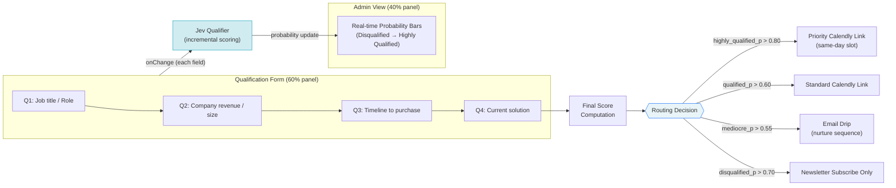


### Incremental Scoring Architecture

The key engineering novelty here is **incremental classification** — Jev is invoked on each field completion event, not at form submission. Each invocation provides accumulated context:

```
Invocation 1 (after Q1):
  Context: Role = "Founder / Executive"
  Q: Qualification level → [disqualified, mediocre, qualified, highly_qualified]
  Result: qualified: 0.52, highly_qualified: 0.31

Invocation 2 (after Q2):
  Context: Role = "Founder / Executive", Revenue = "$20k+/month"
  Result: qualified: 0.71, highly_qualified: 0.58  (← shifted up)

Invocation 3 (after Q3):  
  Context: + Timeline = "As soon as possible"
  Result: qualified: 0.31, highly_qualified: 0.87  (← shifted decisively)
```

The admin panel renders these probability updates as an animated bar chart, providing real-time visibility into how each response shifts the candidate's classification. This is a **posterior update pattern** — each new observation updates the prior probability distribution.

### Self-Calibrating Criteria Extraction

A critical observation from the production implementation: when the form is deployed without explicit criteria provided to Jev, Jev infers qualification criteria from the **structure of the questions themselves**. A question about revenue tier implicitly signals that higher revenue = higher qualification. A question about timeline signals urgency preference. Jev extracts these implicit weightings from contextual semantics.

Explicit criteria injection produces better calibration:

```
System context (injected into Jev prompt):
  For this business automation service, ideal clients are:
  - Founders or executives (not individual contributors)
  - Monthly revenue > $10,000 (indicates budget authority)
  - Timeline < 3 months (indicates genuine intent)
  - Currently using manual or legacy processes (indicates switching motivation)
```

With explicit criteria, the first response classification is significantly more accurate than zero-shot inference.

### Engineering Observations

* **Debounce strategy:** Invoke Jev on `onBlur` (field exit) rather than `onChange` (keystroke). This prevents excessive API calls while still providing near-real-time updates.

* **Latency target:** The 100ms Jev response time means the probability bar update appears to the candidate as instantaneous — below the human perception threshold for "waiting."

* **Session persistence:** Store each invocation's probability vector in the session. On form submission, the final vector is the output — no additional Jev call needed.

* **A/B testing routing thresholds:** The threshold values (0.80, 0.60, 0.55, 0.70) are business parameters, not model parameters. Instrument and A/B test them independently of the Jev model.

---

## Use Case 7 — AI Agent Memory Optimization

### Problem Statement

AI agents with persistent memory systems — where conversation history, learned facts, and task context are stored across sessions — face a fundamental retrieval problem. A naive implementation stores memory in a set of flat markdown files and retrieves them via filename keyword search followed by full-file LLM reading. This approach has two critical failure modes:

1. **Retrieval accuracy:** File selection based on filename keywords misses semantically relevant files with non-obvious names. The agent reads the wrong file, misses the answer, and either hallucinates or reports ignorance.

2. **Token cost:** Reading an entire file to find one relevant paragraph consumes 5,000–15,000 tokens when the answer might require 200. At LLM prices, memory retrieval becomes the dominant cost.

### Old Architecture (Baseline)

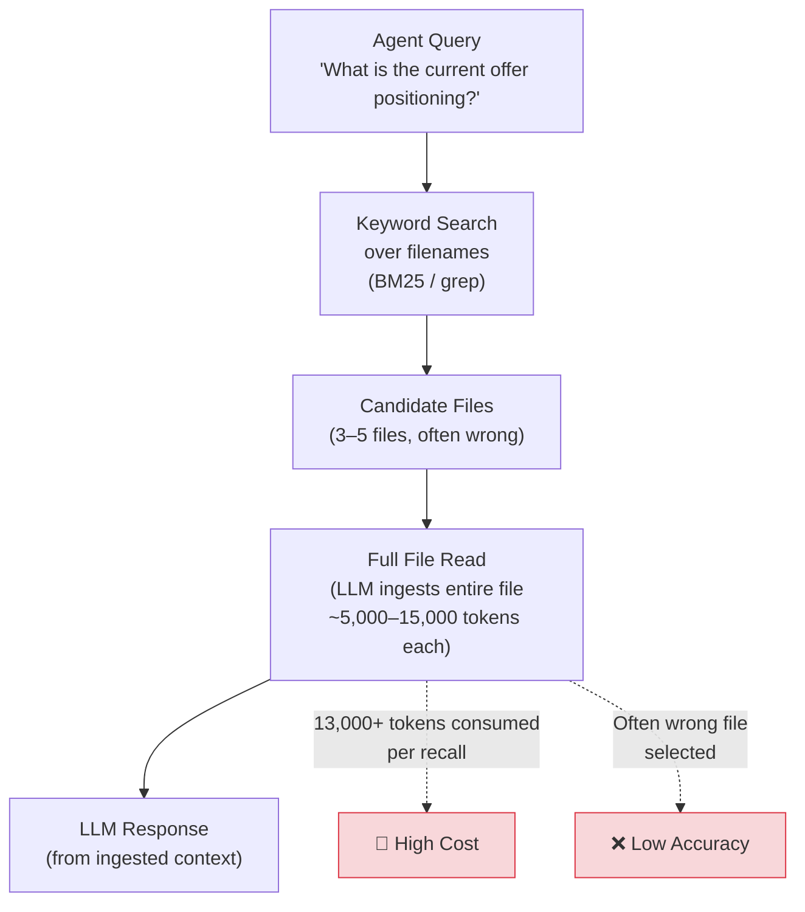

### Jev-Optimized Architecture

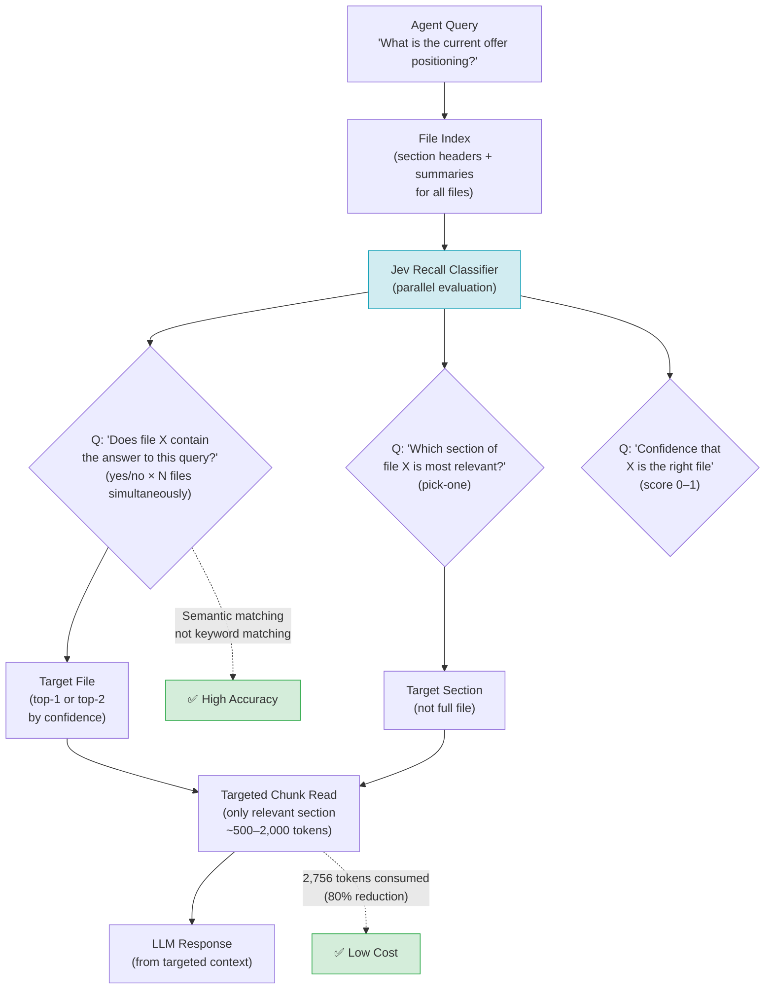


### Measured Token Reduction

From the production implementation (Cursor + Fable 5.1):

| Metric | Old (keyword + full read) | New (Jev + targeted read) |
| --- | --- | --- |
| Tokens per recall | 13,000+ | 2,756 |
| Token reduction | — | **\~80%** |
| Cost per recall | $0.016 (est.) | $0.003 (est.) |
| File accuracy | Poor (filename-dependent) | High (semantic) |

### Write Path Optimization

The read optimization is the headline, but the write path has an equally important Jev integration. When the agent learns something new (a preference, a fact, a completed task), it must determine which existing memory file to append to. The old approach defaults to appending to the daily log — producing a flat, unstructured journal rather than a knowledge graph.

Jev solves the write path with a symmetric question batch:

```
Context: [the new memory to store]
Questions:
  1. Which existing file is most related to this new memory? (pick-one from index)
  2. Should this create a new file rather than appending? (yes/no)
  3. Which section within the target file is most relevant? (pick-one)
  4. Confidence in file selection (score 0–1)
```

The agent uses this to perform **targeted appends** — inserting new memories into semantically appropriate locations rather than a catch-all log. Over time, the memory system develops genuine topical structure rather than chronological accumulation.

### Conceptual Framing: Jev as a "Judgement Engine"

The distinction here is architecturally important: **Jev does not write memory. Code writes memory. Jev makes the small semantic judgements that code uses to decide where and what to write.**

The code handles:

* Reading files

* Counting and chunking text

* Assembling context windows

* Writing appended content

* Maintaining the file index

Jev handles:

* "Is this the right file?" (yes/no)

* "Is this the right section?" (pick-one)

* "Is this new information or a duplicate?" (yes/no)

* "How confident am I?" (score)

This separation of concerns is the key insight. Jev is not a RAG system — it is the **navigation layer** over a RAG system, operating at classification speed and classification cost.

---

## Use Case 8 — Video Moment Scoring and Clip Selection

### Problem Statement

Long-form video content (YouTube, podcasts, interviews) contains high-value moments suitable for short-form clips. Identifying these moments manually is expensive (a professional editor may take 2–4 hours to clip a 60-minute video). LLM-based approaches require full transcription, context-window-constrained analysis, and often miss non-verbal cues. Existing AI clip tools frequently produce low-quality selections that creators reject after testing.

### Architecture

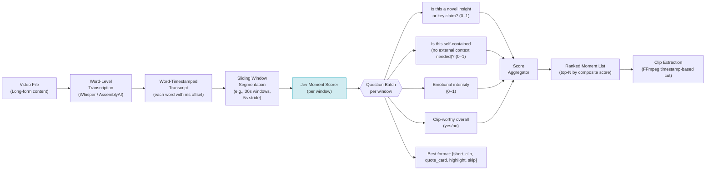


### Scoring 17 Moments in 3 Seconds

The production implementation demonstrated scoring 17 candidate moments in approximately 3 seconds for a full video. This throughput is achievable because:

1. **Parallelization:** All 17 windows are submitted to Jev concurrently (async batch)

2. **Compact context:** Each window is a 30-second word-level transcript segment — approximately 150–250 words of context

3. **Classification overhead:** Jev evaluates each window in <300ms; 17 concurrent requests resolve in one network round-trip

By comparison, a GPT-4o call on the full transcript to "find the best clips" would take 10–30 seconds and cost 10–50× more. More critically, the LLM approach treats the entire video as a single context — losing the precise timestamp precision needed for clean cuts.

### Engineering Observations

* **The timestamp precision problem:** Word-level transcription (Whisper large-v3 or AssemblyAI) provides millisecond-level word offsets. Jev scores windows, and the word offsets within the highest-scoring windows provide exact cut points — no manual trimming needed.

* **Self-containment scoring:** This is the most critical signal for clip quality. A moment that begins with "But as I was saying..." scores low on self-containment and is a poor clip regardless of its insights. Jev's self-containment question filters these naturally.

* **Composite score construction:** The composite score should be a weighted combination, not a simple mean. Emotional intensity without self-containment produces emotionally engaging but contextually confusing clips. Weight: `score = 0.4×insight + 0.35×self_contained + 0.25×emotion`.

* **Format classification:** The format question ("short_clip, quote_card, highlight, skip") enables automated downstream processing — clip extraction vs. text extraction vs. visual overlay. This removes a manual routing step from the production pipeline.

---

## Use Case 9 — Edge-Responsive Smart Home Control

### Problem Statement

Voice-controlled smart home systems (Alexa, Google Home) suffer from a well-documented UX failure: a 2–5 second round-trip from utterance to action creates perceptual uncertainty. The user cannot tell whether the command was received, processed, or failed. This uncertainty is the source of the "repeat the command" behavior common with current voice assistants.

The technical root cause: current consumer voice assistants route all commands through cloud LLMs with full reasoning pipelines — far more capability than "turn on the outdoor lights" requires.

### Architecture: MCP + Jev Control Loop

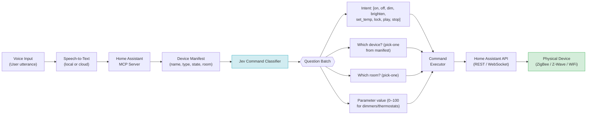


### 300ms End-to-End Latency

The demonstrated latency of 300ms from utterance to device state change is achievable because the control problem is **structurally binary**: a light is on or off. A lock is locked or unlocked. A thermostat is at 68°F or 72°F. These are exactly the decisions Jev is optimized for — discrete states from a known finite set.

Compare to an LLM-based approach:

* LLM must parse the utterance, identify the intent, identify the device, determine the state, formulate a tool call, parse the tool call output, and confirm success

* Round-trip: 2–5 seconds minimum

Jev's approach:

* Classify intent + device + parameter simultaneously in one forward pass

* Round-trip: 100–200ms classification + \~50ms API call = **150–250ms total**

### The MCP Integration Point

Home Assistant's Model Context Protocol (MCP) server exposes the full device registry as a structured manifest — names, types, current states, room assignments, capabilities. This is the device list Jev classifies against. The MCP server also accepts structured command objects, which the executor constructs directly from Jev's output probabilities.

The data flow is entirely deterministic downstream of Jev — probability distributions in, device commands out, with no LLM reasoning required.

### The On-Device Inference Future

The production implementation uses Jev via cloud API. However, the architectural insight points toward on-device deployment. Smart home control is a latency-sensitive, privacy-sensitive application where cloud dependency is both a UX liability (network round-trip) and a privacy concern (all home state transmitted to a cloud service).

Classification models of Jev's type are structurally smaller than generative LLMs — they do not need a full autoregressive decoder stack. Quantized classification models suitable for inference on edge hardware (a Raspberry Pi, an ESP32-S3, or a future Amazon Echo chip) are a natural evolution of this architecture. At that point, the 300ms latency drops to sub-50ms, cloud dependency is eliminated, and the model runs entirely within the home network.

---

## What Jev Fails At

### Financial Signal Prediction

A production test integrated Jev into a Bitcoin trading signal system, polling every minute with a "buy, hold, or sell" classification. The results were statistically indistinguishable from random. The failure mode is instructive.

Financial signal prediction is not a classification problem — it is a **regression problem** over a continuous manifold with no stable semantic structure. The relationship between observable text signals and price movements is:

1. **Non-stationary:** The mapping changes over time as market participants adapt

2. **Sparse-signal:** The causal signal-to-noise ratio is extremely low

3. **Adversarial:** Other models (and human traders) actively trade against predictable patterns

4. **Continuous:** "Buy at 0.34 confidence" is fundamentally different from "send email to human queue at 0.65 confidence" — the cost of a wrong decision is continuous, not categorical

Jev's probability outputs are calibrated on semantic similarity tasks. Applying them to financial prediction requires assuming that semantic confidence correlates with market edge — an assumption that does not hold.

### General Failure Taxonomy

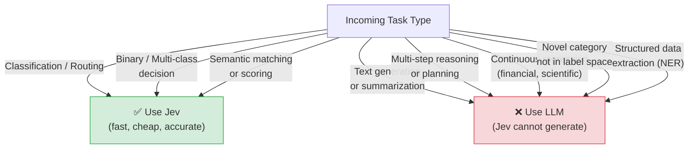


---

## Architectural Patterns and Anti-Patterns

### Pattern 1: Pre-filter + Selective Generation

Use Jev to classify which items warrant LLM processing. Apply LLM only to the routed subset.

**Example topology:** 1,000 inputs → Jev (100% coverage) → 200 escalated items → LLM (20% coverage)

**Cost impact:** If LLM processes 20% of items instead of 100%, total LLM cost reduces by 80%.

### Pattern 2: Compound Classification (Multi-question batch)

Structure Jev queries as multi-question batches rather than single questions. All questions in a batch are evaluated in a single forward pass.

**Inefficient:** 5 separate Jev calls for 5 properties of one email\
**Efficient:** 1 Jev call with 5 questions evaluated simultaneously

### Pattern 3: Threshold Parameterization

Externalize all threshold values as configurable parameters — not hardcoded constants. Store them in your configuration management layer and treat them as business rule parameters, not model parameters.

```python
TRIAGE_THRESHOLDS = {
    "discard": 0.85,
    "auto_reply": 0.72,
    "human_escalation": 0.65,
    "ambiguity_zone": (0.45, 0.65),  # route to secondary review
}
```

### Anti-Pattern 1: Using Jev for Open-Domain Questions

"What is the best response to this customer?" is not a classification question — it requires generation. Routing it to Jev will return meaningless probabilities. Jev's label space must be defined in the prompt; it cannot answer open-ended questions.

### Anti-Pattern 2: Single-Question Invocation at Scale

Calling Jev once per property, per item, in a loop eliminates the latency advantage. Batch questions and batch items (via async concurrent calls).

### Anti-Pattern 3: Using Jev Alone for High-Stakes Decisions

Jev probabilities are semantic confidence scores, not ground truth. For high-stakes decisions (financial transactions, access control, medical triage), Jev should be a component in a decision pipeline with human oversight, audit logging, and fallback logic — not the final decision maker.

---

## Comparative Cost and Latency Analysis

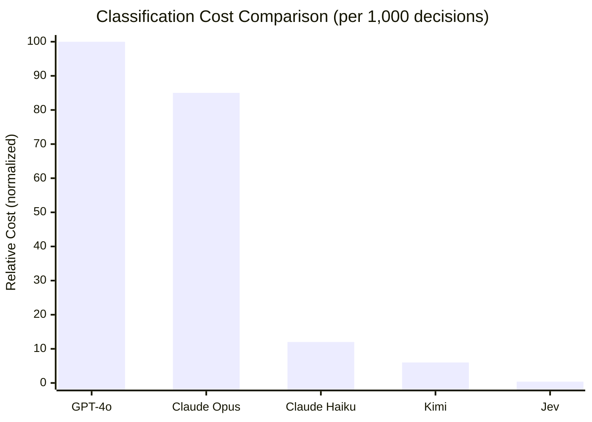

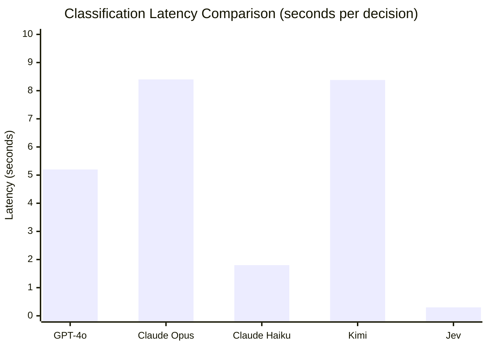

The latency advantage is not incremental — it is categorical. At <300ms, Jev sits in the **real-time interaction tier** alongside WebSocket messages and UI event handlers. At 1.8–8.4 seconds, LLMs sit in the **async processing tier** alongside HTTP requests and database queries.

This means Jev enables architectural patterns that are literally impossible with LLMs:

* In-flight form scoring (Use Case 6) — requires <200ms to feel instantaneous

* Voice browser control (Use Case 2) — requires <300ms to feel real-time

* Smart home control (Use Case 9) — requires <500ms to beat physical switches

---

## Conclusion

Jev represents a specific, valuable tool in the AI inference stack — not a replacement for LLMs, but a complement that fills the classification layer with appropriate speed and cost characteristics.

The nine use cases examined here share a common architectural insight: **the intelligence required to make a routing decision is significantly less than the intelligence required to fulfill the routed request**. Jev is the routing decision layer. LLMs are the fulfillment layer. Separating these responsibilities — rather than using a single expensive model for both — is the core optimization opportunity.

The compound inference architecture (Jev → selective LLM) achieves 60–80% cost reduction on mixed workloads while maintaining or improving responsiveness. At scale, this is not a marginal optimization — it is a fundamental cost structure change.

Key takeaways for engineering teams evaluating Jev:

1. **Define your label space before writing code.** Jev's quality is entirely determined by the quality of the questions you ask it. Ambiguous questions produce low-confidence, low-utility outputs.

2. **Thresholds are business logic, not model parameters.** Externalize them, instrument them, and A/B test them independently of the model.

3. **Batch everything.** Multi-question batches and concurrent async invocations are the primary levers for throughput optimization.

4. **Jev cannot write.** Every use case that requires text generation requires a downstream LLM. Design the pipeline to use Jev for the decision of whether and where to invoke the LLM.

5. **Calibrate for your domain.** The default Jev configuration is a general-purpose classifier. Domain-specific prompt engineering (explicit criteria, domain vocabulary, worked examples) significantly improves accuracy on specialized tasks.

---

_Jev is available at [typesafe.ai](http://typesafe.ai) with direct API access and through OpenRouter during waitlist periods. Native Zapier integration is available directly from Zapier (search "Jev" in the Zapier integration directory)._
